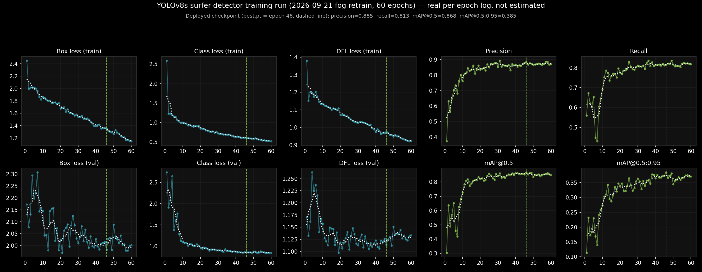
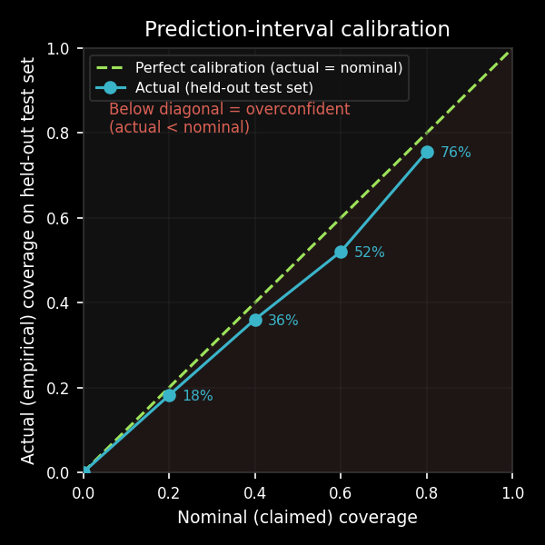

# Sum Surfers

Automated surfer counting from a beach camera.

## What This Project Does, In Plain Terms

There's a live camera pointed at a surf spot in Santa Cruz, California. This project watches that camera and tries to answer two simple questions:
1. **_How many surfers are out there?_**
2. **_How many will there be at different times in the upcoming days?_**

Why Does this matter?  

**_As a surf spot gets more crowded, the competition for each wave becomes more intense.  For this reason many surfers like to know how crowded it will be and some may decide to go at less crowded times._**

Here's the basic idea, step by step:

1. **Gather video.** Each week, the project downloads short clips
   from the camera.
2. **Pull out a picture.** From each video clip, it grabs one still photo and
   crops it down to just the part of the water where surfers actually
   are.
3. **Count the surfers in the picture.** This is the hard part, and it's
   done by a computer-vision model — a program that has been trained on
   thousands of hand-labeled examples to recognize what a surfer in the
   water looks like, and draw a box around each one it finds. This is
   the same basic kind of technology used in things like self-driving
   cars (spotting pedestrians) or photo apps (finding faces). The more
   examples the model has seen, the better it gets at telling a real
   surfer apart from, say, a bird, a shadow, or a wave.
4. **Keep score over time.** Every count gets logged with the date, time,
   and conditions (tide, weather, etc.), building up a running history
   of how many surfers show up throughout the day and across the year.
5. **Make a forecast.** Using that history, a second, simpler model looks for patterns — for example, "it's a weekend, the tide is dropping, and it's sunny" tends to mean more surfers — and uses those patterns to predict roughly how crowded the spot will be later today, hour by hour. It's the same general idea as a weather forecast: not a  guarantee, just an educated, data-backed guess with a likely range attached to it.

The rest of this README below goes into more technical details.

## Technical Overview

This project downloads short video clips around daylight hours, extracts still image frames, runs an object detector on tiled sections of each frame, stores per-clip surfer counts averaged across those frames, and forecasts future surf crowd levels using a variety of real-world conditions as inputs.  In brief, the project does the following:

1. Downloads a short video clip from the camera from each hour during daylight hours (real dawn to dusk for that
   date, not fixed clock times), into a dated folder.
2. Extracts 3 cropped [regions of interest](docs/HOW_IT_WORKS.md#term-roi)
   from each clip — a primary frame plus 2 "side" frames a few seconds
   apart — so one count isn't at the mercy of a single unlucky frame
   (someone briefly hidden behind a wave, a bird flying through, etc.).
3. Checks the primary frame's brightness and blur before running
   detection; frames too dark or too blurred (fog, dusk, a wet lens) are  skipped entirely rather than counted wrong. 
4. Splits each frame into 4 overlapping horizontal tiles — small, distant surfers are easier for the detector to find within a tile than scattered across one wide frame — runs the object detection model [YOLOv8](docs/HOW_IT_WORKS.md#main-resources) on each tile, then
   merges detections that land on a tile boundary back into one count
   per frame.
5. Averages the 3 per-frame counts into one per-clip count, and appends
   the result — plus the 3 raw per-frame counts, for later analysis —
   to `data/predictions/predictions.csv`.
6. Collects the real-world conditions that help explain and forecast
   crowd size — weather, tide height, swell, wind, and wave energy for
   the spot, today and tomorrow — and matches each hour of that data to
   the surfer counts already logged, building up a table the forecast
   model can learn from.
7. Feeds that combined table (past counts + the conditions at the time)
   into a forecasting model, which learns which conditions tend to mean
   more or fewer surfers, then uses tomorrow's forecasted conditions to
   predict an hour-by-hour surfer count for the coming day, along with a
   likely range around each prediction (see "Surfer Count Prediction
   Model" below).
8. Once a day, redraws the detection-review image (a recent camera frame
   with the model's boxes drawn on it) and the daily forecast chart with
   the latest data, and automatically commits both images to this
   repository — which is why the two images below update on their own
   each day without anyone manually running anything.

See [HOW_IT_WORKS.md](docs/HOW_IT_WORKS.md) for a full walkthrough of the
detection pipeline and a glossary of every term used in this repo,
[PROJECT_HISTORY.md](docs/PROJECT_HISTORY.md) for how it was built and
tuned over time, and [PROJECT_FILES.md](docs/PROJECT_FILES.md) for a map
of what every file in this repo does.

<!-- DAILY_CHART_START -->
#### A Recent Surfer Detection Count: Thursday, September 10, 2026, 8:05 AM

Each green box below contains a surfer, according to the object detection model.  Each number above a box indicates the probability that the object is a surfer.  Look carefully and you may find additional surfers that the model missed or other objects which are misclassified as surfers - like the wind sock at the bottom center of the photo.


#### The Surfer Crowd Forecast for: Friday, September 11, 2026

Once enough hours and days were gathered along with weather and surf conditions, a surf count prediction model was built to forecast how many surfers would be present at each hour for the coming day.  This is useful for surfers to plan to avoid busy times or at least know what to expect.  Recently the predictions have been low compared to actual counts, so more images are being collected to improve the object detection model's ability to find surfers in a variety of light and water conditions, like fog or choppy water surfaces.


<!-- DAILY_CHART_END -->

### How to Read the Daily Chart

- **Aqua line** — the model's single best-guess ("median") count for each
  hour.
- **Shaded gradient + side table ("80% Range")** — the model's
  [prediction interval](docs/HOW_IT_WORKS.md#term-prediction-interval): the range the
  real count is expected to fall in on most days, shown both as a
  gradient around the line (darker = more likely, fading out toward the
  10%/90% edges) and as plain numbers in the table. **It isn't perfectly
  calibrated** — see [Model Calibration](#model-calibration) below for
  the real, measured accuracy of this range, not just the claimed one.
- **Weather markers** (circle/square/triangle/diamond) — the model's
  predicted weather condition for that hour, plotted at the median
  count.
- **Green dashed line (right-hand axis)** — predicted tide height, in
  feet.
- **Hatched band / "no training data" label** — flags hours with little
  or no real training data behind them (night hours, or hours outside
  the model's normal range) — treat those points as a rough
  extrapolation, not a confident prediction.
- **Caption** — the conditions driving that day's forecast, plus the
  detector's actual [precision](docs/HOW_IT_WORKS.md#term-precision) and
  [recall](docs/HOW_IT_WORKS.md#term-recall) from its real training log
  (not estimated).

See [HOW_IT_WORKS.md](docs/HOW_IT_WORKS.md) for a deeper walkthrough of
the detection pipeline and a glossary of every term used on this page,
and [PROJECT_HISTORY.md](docs/PROJECT_HISTORY.md) for the full history
of how the forecast model was built, tested, and tuned.

## Object Detection: Model, Training Data & Tools

The step that actually counts surfers in a picture — step 3 in the plain
overview above — is an **object detection** model. Object detection is a
computer-vision task: given an image, find every instance of a chosen
object type and draw a box around each one, rather than just labeling
the image as a whole ("this photo contains a surfer" vs. exactly where
and how many). It's the same underlying technology behind a photo app
circling faces or a self-driving car outlining nearby pedestrians — here
it's just pointed at a stretch of ocean, looking for surfers instead.

A model like this doesn't know what a surfer looks like on its own. It
has to be *trained*: shown a large number of real images where a human
has already drawn the correct box around every surfer, and left to
gradually adjust itself until its own boxes start matching those
examples closely. More and more varied examples generally make it
better at telling a real surfer apart from a bird, a shadow, or a patch
of whitewater.

### The Model: YOLO

This project uses **YOLO** ("You Only Look Once"), a well-known family
of object-detection models — specifically **YOLOv8s**, the "small," CPU-
friendly variant of version 8, via the open-source
[Ultralytics library](docs/HOW_IT_WORKS.md#main-resources). "Single-pass"
here means the model looks at the whole image once and predicts every
box, and how confident it is in each one, in one step — rather than
scanning it multiple times — which is what makes it fast enough to run
on an ordinary laptop with no dedicated graphics card. Because surfers
are small relative to the wide strip of ocean the camera sees, each
frame is first split into 4 overlapping tiles and the model runs on each
tile separately (see "Technical Overview" above) — a small object is
easier to find in a smaller, more zoomed-in image.

### Training Data & Labeling: CVAT

Training a model requires real, hand-labeled examples. This project's
57 training images (1,451 hand-drawn boxes total) were labeled using
[CVAT](docs/HOW_IT_WORKS.md#main-resources) (Computer Vision Annotation
Tool), an open-source browser tool made for exactly this kind of work —
a person opens each image, draws a box around every surfer in it, and
CVAT exports the result in a format the model can train on. Those 57
images were split 32/15/10 into training, validation, and test sets (a
model is trained only on the training set, and checked against images
it's never seen — validation and test — so its reported accuracy
reflects genuine performance, not memorization), and were tiled the same
4-way split described above before training, so the model learns on
exactly the shape of image it sees in production. See
[HOW_IT_WORKS.md](docs/HOW_IT_WORKS.md) for the full training walkthrough
and [`train_model.py`](code/train_model.py) for the retraining script
itself.

### Detector Training Metrics

Real per-[epoch](docs/HOW_IT_WORKS.md#term-epoch) training log for the
production YOLOv8s surfer detector (60 epochs) — 10 charts tracking how
training went, not estimated after the fact. The white dotted line on
each chart is a 5-epoch rolling average, to make the trend easier to
see through the epoch-to-epoch noise.

- **Top row, first 3 charts (aqua): training [loss](docs/HOW_IT_WORKS.md#term-loss)** —
  box loss, class loss, and DFL loss, measured on the data the model was
  actually training on. All three should generally trend downward, and
  do here — the model is getting better at matching its own training
  examples.
- **Bottom row, first 3 charts (aqua): validation loss** — the same
  three loss measurements, but on the held-out validation images the
  model never trains on. This is the more meaningful set of loss
  charts, since it shows how the model does on images it hasn't
  memorized. They trend downward too, with more visible noise
  (validation is a much smaller set of images than training) but no
  sign of the val loss rising while train loss keeps falling, which
  would signal overfitting.
- **Top row, last 2 charts (lime): [precision](docs/HOW_IT_WORKS.md#term-precision)
  and [recall](docs/HOW_IT_WORKS.md#term-recall)** — both computed on
  the validation set each epoch, not the training data, so they reflect
  genuine model performance rather than how well it memorized what it
  trained on. Both climb from noisy, mediocre starting values toward
  their final ~88%/~81%, with a rough patch in the first ~15 epochs
  where the model still hasn't learned much and both metrics swing
  widely epoch to epoch.
- **Bottom row, last 2 charts (lime): [mAP](docs/HOW_IT_WORKS.md#term-map)@0.5
  and mAP@0.5:0.95** — single-number summaries that combine precision
  and recall at one confidence threshold (0.5) or averaged across many
  stricter ones (0.5:0.95), also on the validation set. Same overall
  shape as precision/recall: noisy early on, climbing and flattening out
  by around epoch 40, which is a sign training had mostly converged by
  then rather than still improving at epoch 60.



Final epoch: precision 87.8%, recall 80.6%, mAP@0.5 84.4%, mAP@0.5:0.95
37.3% — the same real numbers cited in the daily chart's caption. Note
mAP@0.5:0.95 (37.3%) is much lower than mAP@0.5 (84.4%): it's an average
over much stricter box-overlap requirements (up to near-perfect box
placement), not a sign the model is actually worse than the headline
84.4% number suggests.

## Surfer Count Prediction Model

A separate modeling pipeline on top of `data/predictions/predictions.csv` +
`data/predictor_vars/surfline_predictors.csv`, built in three phases (see
[`PROJECT_HISTORY.md`](docs/PROJECT_HISTORY.md) for the full story,
including bugs found and fixed along the way). Scripts below
live in `code/`:

- `backfill_openmeteo_weather.py` — adds real observed historical
  weather (Open-Meteo archive API, free/no-auth) to
  `data/predictor_vars/openmeteo_weather.csv`.
- `build_training_features.py` — joins predictions (target) with
  predictors (features) for `quality_ok=True` rows, adds derived
  time-of-day/day-of-week/month features. Writes `data/training_features.csv`.
- `fit_surfer_count_model.py` — fits and compares a Poisson
  [GLM](docs/HOW_IT_WORKS.md#term-glm), a negative-binomial GLM, and
  [gradient-boosted trees (GBT)](docs/HOW_IT_WORKS.md#term-gbt) — GBT is
  the best performer, off by ~6 surfers on average
  ([MAE](docs/HOW_IT_WORKS.md#term-mae)) — plus GBT-based prediction
  intervals (see [Model Calibration](#model-calibration) below).
- `predict_surf_count.py` — pulls live tomorrow's forecast and outputs
  a prediction with an 80% range:
    ```bash
    python code/predict_surf_count.py                          # tomorrow, default hours
    python code/predict_surf_count.py --date 2026-08-28 --hours 07:10,12:00
    ```
- `demo_predictions.py` — shows N random held-out predictions
  alongside the actual count and conditions, for eyeballing model behavior.
- `plot_daily_prediction.py` + `daily_chart.sh` — generates a daily
  prediction chart (median line + a continuous 10-90% prediction-interval
  gradient with a side-by-side 80%-range table, tide, weather, night
  shading) and a detection-review image (real boxes/labels on the day's
  ~8am crop with the predicted range overlaid), auto-committed to the top
  of this README. Run via its own daily cron entry, independent of the
  twice-weekly clip pipeline. See "How to Read the Daily Chart" below for
  what everything on it means.

Caveat: held-out MAE is ~6 surfers on a typical count of ~15 — treat
outputs as directional estimates, not precise counts.

See [HOW_IT_WORKS.md](docs/HOW_IT_WORKS.md) for how the real-world
condition data above (weather, tide, swell, wind, wave energy) is
collected, and [PROJECT_FILES.md](docs/PROJECT_FILES.md) for a map of
every script and data file in this repo, including the clip-download and
detection scripts not listed above.

### Model Calibration

Empirical coverage of the GBT quantile prediction intervals, checked
directly against a held-out test split (`analysis/surf_count_model_calibration/plot_calibration.py`)
rather than trusted from the nominal target:



The narrower intervals (20-60%) run a few points under their nominal
target — mildly overconfident, in the normal direction for this kind of
model. The wide 80% interval instead measures *above* nominal (~83%
actual vs. 80% claimed): its lower bound is the 10th-percentile model,
and since ~12% of real held-out counts are genuinely 0, that bound
floors at 0 and can't be undershot, which mechanically inflates coverage
at that one point rather than reflecting better-than-usual calibration.
This is a real re-check of a number reported earlier
([`PROJECT_HISTORY.md`](docs/PROJECT_HISTORY.md)) as "closer to 65% than
80%" — re-run today on the current codebase and current data, it comes
out differently (see PROJECT_HISTORY.md for the investigation).

### Exploratory Findings

Tide and weekend/weekday are the two strongest predictors of surfer count
at this spot (see [`PROJECT_HISTORY.md`](docs/PROJECT_HISTORY.md) for the full
GBT permutation-importance breakdown). A closer look at the weekend effect:

#### Weekday vs. Weekend

1. The weekend-to-weekday ratio varies noticeably by month — from about
   1.16-1.18x in March, May, and July 2026 up to nearly 2x in November
   2025 (also elevated, ~1.5x, in October/December 2025 and August
   2026). Some months show a much more pronounced weekend effect than
   others. We'll have to see if the trend holds once we have data from
   every month — several calendar months are still completely
   unrepresented in the dataset so far.
2. Weekends are also more variable day-to-day than weekdays: standard
   deviation 6.7 vs 5.6 surfers.


#### Daily Mean Count Kernel Density Estimate (KDE)

1. Each curve is normalized to its own group (n=61 weekdays, n=31
   weekends) — the taller weekday peak isn't a sample-size artifact.
2. Weekday counts cluster closer to their mean (std 5.6 vs 6.7), giving
   it a taller, narrower peak.
3. Weekends span a wider range (min 3.8 to max 33.8 vs weekday's 1.5 to
   28.0).


## Schedule

`local_pipeline.sh` (clip collection + detection) and
`daily_chart.sh` (the daily prediction chart) each run automatically on
their own recurring schedule on the machine hosting the pipeline —
`local_pipeline.sh` a couple times a week, `daily_chart.sh` once a day.
Both are safe to run manually any time; see each script for details.

## Local Setup

1. Create and activate a virtual environment.
2. Install dependencies.
3. Add secrets to `.env`.
4. Run the pipeline.

```bash
python3 -m venv .venv
source .venv/bin/activate
pip install --upgrade pip
pip install -r docs/requirements.txt
cp .env.example .env
bash code/local_pipeline.sh
```

## Required Environment Variables

Create `.env` from `.env.example` and set:

- `SURFLINE_CAMERA_ID`
- `SURFLINE_ACCESS_TOKEN`

Optional:

- `MODEL_PATH` (override default YOLO weights path)
- `SMTP_USER` / `SMTP_APP_PASSWORD` / `EMAIL_TO` (Gmail App Password, for storage-warning emails)
- `CLIPS_DIR_LIMIT_GB` (local clip storage warning threshold, default 2.0)
- `DETECT_MODE` / `DETECT_RECENT_DAYS` / `DETECT_START_DATE` (detection scope)
- `SURFLINE_HISTORICAL_TOKEN` (only for `backfill_historical_predictors.py`,
  never read by the scheduled pipeline — see that script's docstring)

## Data Locations

- Clips: `data/not_needed_in_repo/surf_clips`
- Crops: `data/j_shore_cam/surf_crops`
- Predictions: `data/predictions/predictions.csv` — one row per clip:
  `date, time_local, filename, surfer_count, confidence_avg, quality_ok,
  quality_reason, brightness, lap_var, human_count, frame_count_1,
  frame_count_2, frame_count_3, frame_count_mean, frame_count_stdev`.
  `surfer_count`/`confidence_avg` are left blank when `quality_ok` is
  `False` (detection was skipped). `human_count` is filled in manually
  over time. `frame_count_*` are the 3 raw per-frame counts and their
  mean/stdev that `surfer_count` is averaged from.
- Predictor variables (weather/rating/tide/swell/wind/energy/consistency
  for Jack's, plus observed Open-Meteo weather): `data/predictor_vars/`
- Human-review datasets (image batches + a `review_counts.csv` to fill
  in), one subfolder per dataset: `data/reviews/`
- Model weights default:
  `data/model_out/20251013/train/runs/detect/train13/weights/best.pt`

## Analysis

One-off analyses (not part of the scheduled pipeline) each get their own
folder under `analysis/`, holding whatever mix of CSVs, charts, and
plotting/analysis scripts that investigation produced — see
[`PROJECT_FILES.md`](docs/PROJECT_FILES.md) for what's in each one.

