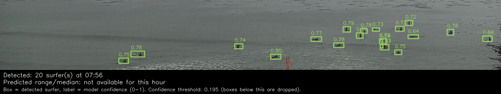
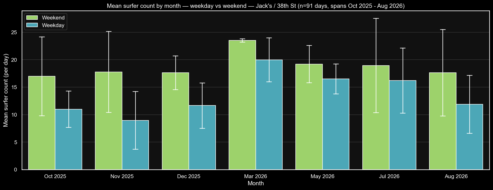
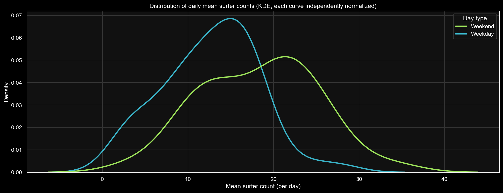

# Sum Surfers

Automated surfer counting from Surfline clips.

This project downloads short clips around daylight hours, extracts 3 cropped frames per clip (~1.5-3s apart), runs YOLOv8 inference on tiled images, and stores per-clip surfer counts averaged across those frames.

<!-- DAILY_CHART_START -->
## A Recent Surfer Detection Count: Friday, August 28, 2026, 7:56 AM



## The Surfer Crowd Forecast for: Sunday, August 30, 2026


<!-- DAILY_CHART_END -->

## What This Repo Does

1. Pulls Surfline clips into dated folders.
2. Extracts 3 ROI frames from each clip (a primary frame + 2 "side" frames a
   few seconds apart).
3. Checks the primary frame's image quality (brightness/blur) and skips
   detection on frames too dark or too foggy/blurred to reliably count.
4. Runs tiled YOLOv8 inference on all 3 frames and deduplicates boxes across
   tile boundaries.
5. Averages the 3 per-frame counts and appends the result (plus the raw
   per-frame data) to `data/predictions/predictions.csv`.

Started project on a cloud VM, but then realized training and inference could be run locally for free for now. See
[`HOW_IT_WORKS.md`](docs/HOW_IT_WORKS.md) for a full walkthrough of the
detection pipeline and a glossary of terms, [`PROJECT_HISTORY.md`](docs/PROJECT_HISTORY.md)
for how it was built and tuned over time, and [`PROJECT_FILES.md`](docs/PROJECT_FILES.md)
for a map of what every file in this repo is for.

## Pipeline Scripts

- `code/local_pipeline.sh`
  - The entry point. Downloads clips, extracts crops, checks local clip
    storage, runs detection, pulls Surfline predictors, records a success
    timestamp.
- `code/get_clips.py`
  - Downloads clips between real dawn and dusk (civil twilight) — Surfline's
    own live light forecast for today, astral (corrected camera coordinates)
    for backfill days.
  - Uses the nearest Surfline clip windows and can backfill up to the previous 5 days.
- `code/get_cropped_frame.py`
  - Reads downloaded clips and saves 3 cropped JPG frames each (primary +
    2 side frames), for multi-frame count averaging.
- `code/detect_surfers.py`
  - Checks the primary frame's brightness/blur before running detection,
    skipping all 3 frames if it's too dark or too foggy to reliably count
    (see [`HOW_IT_WORKS.md`](docs/HOW_IT_WORKS.md)).
  - Runs YOLO on 4 horizontal overlapping tiles per frame, deduplicates
    boxes, filters out known static false positives, averages the 3
    per-frame counts, and writes the result plus raw per-frame data.
- `code/backfill_multiframe_counts.py`
  - Manual, one-off script that backfills `frame_count_*` for existing
    `predictions.csv` rows whose raw clip is still on disk — never touches
    the original `surfer_count`/`confidence_avg`.
- `code/get_surf_predictors.py`
  - Pulls weather, rating, tide, swell, wind, wave-energy, and consistency
    data for Jack's from Surfline's public forecast API and appends to
    `data/predictor_vars/surfline_predictors.csv`, matched to
    `predictions.csv` rows by filename. Forward-looking only (today + tomorrow).
- `code/backfill_historical_predictors.py`
  - Manual, one-off script (not run by `local_pipeline.sh`) that backfills
    the same predictor fields for past dates, using Surfline's historical
    API with a personal account session token. See the script's docstring
    for usage and safety notes before running it.
- `code/backfill_predictors_from_har.py`
  - Manual, one-off script: an alternative to the token-based backfill,
    parsing HAR files exported from clicking through Surfline's own
    Historical view instead of making live requests. Cannot get
    `weather_condition`/`temperature_f`/`pressure_mb`/`consistency_wave_count`
    (the Historical view never fetches those) — see the script's docstring.
- `code/manage_clips.py`
  - Emails a warning if local clip storage exceeds `CLIPS_DIR_LIMIT_GB`.
- `code/send_email.py`
  - Shared Gmail SMTP sender used for storage warnings.

## Surfer Count Prediction Model

A separate modeling pipeline on top of `data/predictions/predictions.csv` +
`data/predictor_vars/surfline_predictors.csv`, built in three phases (see
[`PROJECT_HISTORY.md`](docs/PROJECT_HISTORY.md) for the full story,
including two real bugs found and fixed along the way):

- `code/backfill_openmeteo_weather.py` — adds real observed historical
  weather (Open-Meteo archive API, free/no-auth) to
  `data/predictor_vars/openmeteo_weather.csv`.
- `code/build_training_features.py` — joins predictions (target) with
  predictors (features) for `quality_ok=True` rows, adds derived
  time-of-day/day-of-week/month features. Writes `data/training_features.csv`.
- `code/fit_surfer_count_model.py` — fits and compares Poisson GLM,
  negative-binomial GLM, and gradient-boosted trees (the best performer,
  ~6 surfer MAE), plus GBT quantile-regression prediction intervals.
- `code/predict_surf_count.py` — pulls live tomorrow's forecast and outputs
  a prediction with an 80% range:
    ```bash
    python code/predict_surf_count.py                          # tomorrow, default hours
    python code/predict_surf_count.py --date 2026-08-28 --hours 07:10,12:00
    ```
- `code/demo_predictions.py` — shows N random held-out predictions
  alongside the actual count and conditions, for eyeballing model behavior.
- `code/plot_daily_prediction.py` + `code/daily_chart.sh` — generates a daily
  prediction chart (median + 33%/66% bands with a side-by-side range table,
  tide, wave energy, weather, night shading) and a detection-review image
  (real boxes/labels on the day's ~8am crop with the predicted range
  overlaid), auto-committed to the top of this README. Run via its own
  daily cron entry, independent of the twice-weekly clip pipeline.

Caveat: held-out MAE is ~6 surfers on a typical count of ~15, and the
reported 80% prediction interval is empirically closer to a 65%
interval — treat outputs as directional estimates, not precise counts.

### Exploratory Findings

Tide and weekend/weekday are the two strongest predictors of surfer count
at this spot (see [`PROJECT_HISTORY.md`](docs/PROJECT_HISTORY.md) for the full
GBT permutation-importance breakdown). A closer look at the weekend effect:





## Schedule

`code/local_pipeline.sh` (clip collection + detection) and
`code/daily_chart.sh` (the daily prediction chart) each run automatically on
their own recurring schedule on the machine hosting the pipeline —
`local_pipeline.sh` a couple times a week, `daily_chart.sh` once a day.
Both are safe to run manually any time; see each script for details.

## Local Setup

1. Create and activate a virtual environment.
2. Install dependencies.
3. Add secrets to `.env`.
4. Run the pipeline.

```bash
python3 -m venv .venv
source .venv/bin/activate
pip install --upgrade pip
pip install -r docs/requirements.txt
cp .env.example .env
bash code/local_pipeline.sh
```

## Required Environment Variables

Create `.env` from `.env.example` and set:

- `SURFLINE_CAMERA_ID`
- `SURFLINE_ACCESS_TOKEN`

Optional:

- `MODEL_PATH` (override default YOLO weights path)
- `SMTP_USER` / `SMTP_APP_PASSWORD` / `EMAIL_TO` (Gmail App Password, for storage-warning emails)
- `CLIPS_DIR_LIMIT_GB` (local clip storage warning threshold, default 2.0)
- `DETECT_MODE` / `DETECT_RECENT_DAYS` / `DETECT_START_DATE` (detection scope)
- `SURFLINE_HISTORICAL_TOKEN` (only for `backfill_historical_predictors.py`,
  never read by the scheduled pipeline — see that script's docstring)

## Data Locations

- Clips: `data/not_needed_in_repo/surf_clips`
- Crops: `data/j_shore_cam/surf_crops`
- Predictions: `data/predictions/predictions.csv` — one row per clip:
  `date, time_local, filename, surfer_count, confidence_avg, quality_ok,
  quality_reason, brightness, lap_var, human_count, frame_count_1,
  frame_count_2, frame_count_3, frame_count_mean, frame_count_stdev`.
  `surfer_count`/`confidence_avg` are left blank when `quality_ok` is
  `False` (detection was skipped). `human_count` is filled in manually
  over time. `frame_count_*` are the 3 raw per-frame counts and their
  mean/stdev that `surfer_count` is averaged from.
- Predictor variables (weather/rating/tide/swell/wind/energy/consistency
  for Jack's, plus observed Open-Meteo weather): `data/predictor_vars/`
- Human-review datasets (image batches + a `review_counts.csv` to fill
  in), one subfolder per dataset: `data/reviews/`
- Model weights default:
  `data/model_out/20251013/train/runs/detect/train13/weights/best.pt`

## Analysis

One-off analyses (not part of the scheduled pipeline) each get their own
folder under `analysis/`, holding whatever mix of CSVs, charts, and
plotting/analysis scripts that investigation produced — see
[`PROJECT_FILES.md`](docs/PROJECT_FILES.md) for what's in each one.

