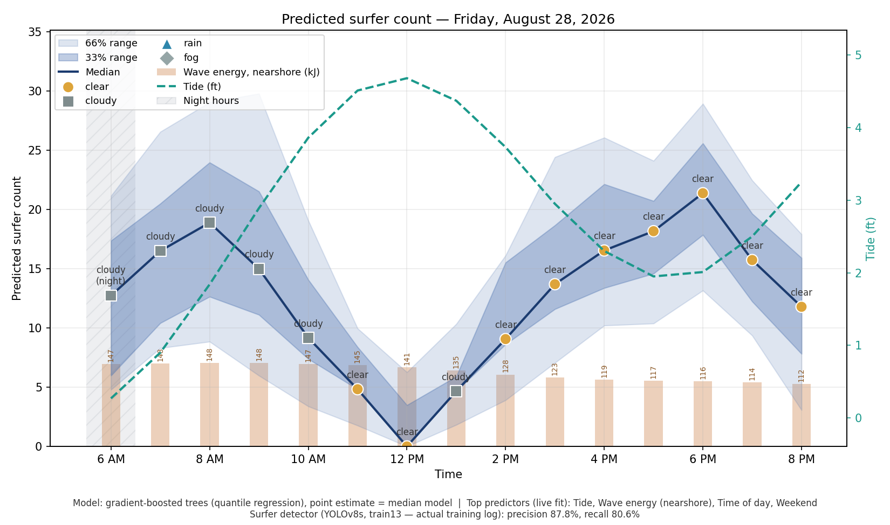

# Sum Surfers

Automated surfer counting from Surfline clips.

This project downloads short clips around daylight hours, extracts 3 cropped frames per clip (~1.5-3s apart), runs YOLOv8 inference on tiled images, and stores per-clip surfer counts averaged across those frames.

<!-- DAILY_CHART_START -->
## Today's Surfer Count Prediction

_Last updated: 2026-08-28 10:14 AM_



**Predicted surfer count — Friday, August 28, 2026** (33% range around the median)

| Time | Range |
|---|---|
| 6:00 AM | 6–17 |
| 7:00 AM | 10–20 |
| 8:00 AM | 13–24 |
| 9:00 AM | 11–22 |
| 10:00 AM | 7–14 |
| 11:00 AM | 5–8 |
| 12:00 PM | 0–3 |
| 1:00 PM | 5–6 |
| 2:00 PM | 9–16 |
| 3:00 PM | 12–19 |
| 4:00 PM | 13–22 |
| 5:00 PM | 15–21 |
| 6:00 PM | 18–26 |
| 7:00 PM | 12–20 |
| 8:00 PM | 8–16 |

<!-- DAILY_CHART_END -->

## What This Repo Does

1. Pulls Surfline clips into dated folders.
2. Extracts 3 ROI frames from each clip (a primary frame + 2 "side" frames a
   few seconds apart).
3. Checks the primary frame's image quality (brightness/blur) and skips
   detection on frames too dark or too foggy/blurred to reliably count.
4. Runs tiled YOLOv8 inference on all 3 frames and deduplicates boxes across
   tile boundaries.
5. Averages the 3 per-frame counts and appends the result (plus the raw
   per-frame data) to `data/predictions.csv`.

Runs entirely on a local machine via cron — no cloud VM involved. See
`HOW_IT_WORKS.md` for a full walkthrough of the detection pipeline and a
glossary of terms, and `PROJECT_HISTORY.md` for how it was built and
tuned over time.

## Pipeline Scripts

- `code/local_pipeline.sh`
  - The entry point. Downloads clips, extracts crops, checks local clip
    storage, runs detection, pulls Surfline predictors, records a success
    timestamp.
- `code/get_clips.py`
  - Downloads clips between real dawn and dusk (civil twilight) — Surfline's
    own live light forecast for today, astral (corrected camera coordinates)
    for backfill days.
  - Uses the nearest Surfline clip windows and can backfill up to the previous 5 days.
- `code/get_cropped_frame.py`
  - Reads downloaded clips and saves 3 cropped JPG frames each (primary +
    2 side frames), for multi-frame count averaging.
- `code/detect_surfers.py`
  - Checks the primary frame's brightness/blur before running detection,
    skipping all 3 frames if it's too dark or too foggy to reliably count
    (see `HOW_IT_WORKS.md`).
  - Runs YOLO on 4 horizontal overlapping tiles per frame, deduplicates
    boxes, filters out known static false positives, averages the 3
    per-frame counts, and writes the result plus raw per-frame data.
- `code/backfill_multiframe_counts.py`
  - Manual, one-off script that backfills `frame_count_*` for existing
    `predictions.csv` rows whose raw clip is still on disk — never touches
    the original `surfer_count`/`confidence_avg`.
- `code/get_surf_predictors.py`
  - Pulls weather, rating, tide, swell, wind, wave-energy, and consistency
    data for Jack's from Surfline's public forecast API and appends to
    `data/surfline_predictors.csv`, matched to `predictions.csv` rows by
    filename. Forward-looking only (today + tomorrow).
- `code/backfill_historical_predictors.py`
  - Manual, one-off script (not run by `local_pipeline.sh`) that backfills
    the same predictor fields for past dates, using Surfline's historical
    API with a personal account session token. See the script's docstring
    for usage and safety notes before running it.
- `code/backfill_predictors_from_har.py`
  - Manual, one-off script: an alternative to the token-based backfill,
    parsing HAR files exported from clicking through Surfline's own
    Historical view instead of making live requests. Cannot get
    `weather_condition`/`temperature_f`/`pressure_mb`/`consistency_wave_count`
    (the Historical view never fetches those) — see the script's docstring.
- `code/manage_clips.py`
  - Emails a warning if local clip storage exceeds `CLIPS_DIR_LIMIT_GB`.
- `code/send_email.py`
  - Shared Gmail SMTP sender used for storage warnings.

## Surfer Count Prediction Model

A separate modeling pipeline on top of `predictions.csv` +
`surfline_predictors.csv`, built in three phases (see `PROJECT_HISTORY.md`
for the full story, including two real bugs found and fixed along the way):

- `code/backfill_openmeteo_weather.py` — adds real observed historical
  weather (Open-Meteo archive API, free/no-auth) to `data/openmeteo_weather.csv`.
- `code/build_training_features.py` — joins predictions (target) with
  predictors (features) for `quality_ok=True` rows, adds derived
  time-of-day/day-of-week/month features. Writes `data/training_features.csv`.
- `code/fit_surfer_count_model.py` — fits and compares Poisson GLM,
  negative-binomial GLM, and gradient-boosted trees (the best performer,
  ~6 surfer MAE), plus GBT quantile-regression prediction intervals.
- `code/predict_surf_count.py` — pulls live tomorrow's forecast and outputs
  a prediction with an 80% range:
    ```bash
    python code/predict_surf_count.py                          # tomorrow, default hours
    python code/predict_surf_count.py --date 2026-08-28 --hours 07:10,12:00
    ```
- `code/demo_predictions.py` — shows N random held-out predictions
  alongside the actual count and conditions, for eyeballing model behavior.
- `code/plot_daily_prediction.py` + `code/daily_chart.sh` — generates a daily
  prediction chart to `data/charts/surfer_count_YYYY-MM-DD.png` (median +
  33%/66% bands, tide, wave energy, weather, night shading). Run via its own
  daily cron entry, independent of the twice-weekly clip pipeline.

Honest caveat: held-out MAE is ~6 surfers on a typical count of ~15, and
the reported 80% prediction interval is empirically closer to a 65%
interval — treat outputs as directional estimates, not precise counts.

## Schedule

Clip collection + detection runs twice a week via cron (Tue/Thu):

```cron
0 19 * * 2,4 caffeinate -i /path/to/sum-surfers/code/local_pipeline.sh >> /path/to/sum-surfers/data/local_pipeline.log 2>&1
```

`caffeinate -i` keeps the laptop awake for the run; if the laptop is asleep or off at the scheduled time, the run is skipped.

The daily prediction chart runs separately, once a day (doesn't need new
clips, just the live forecast + existing model):

```cron
0 19 * * * /path/to/sum-surfers/code/daily_chart.sh >> /path/to/sum-surfers/data/daily_chart.log 2>&1
```

## Local Setup

1. Create and activate a virtual environment.
2. Install dependencies.
3. Add secrets to `.env`.
4. Run the pipeline.

```bash
python3 -m venv .venv
source .venv/bin/activate
pip install --upgrade pip
pip install requests astral pytz opencv-python-headless ultralytics torch torchvision
pip install pandas numpy statsmodels scikit-learn  # for the surfer-count prediction model
cp .env.example .env
bash code/local_pipeline.sh
```

## Required Environment Variables

Create `.env` from `.env.example` and set:

- `SURFLINE_CAMERA_ID`
- `SURFLINE_ACCESS_TOKEN`

Optional:

- `MODEL_PATH` (override default YOLO weights path)
- `SMTP_USER` / `SMTP_APP_PASSWORD` / `EMAIL_TO` (Gmail App Password, for storage-warning emails)
- `CLIPS_DIR_LIMIT_GB` (local clip storage warning threshold, default 2.0)
- `DETECT_MODE` / `DETECT_RECENT_DAYS` / `DETECT_START_DATE` (detection scope)
- `SURFLINE_HISTORICAL_TOKEN` (only for `backfill_historical_predictors.py`,
  never read by the scheduled pipeline — see that script's docstring)

## Data Locations

- Clips: `data/not_needed_in_repo/surf_clips`
- Crops: `data/j_shore_cam/surf_crops`
- Predictions: `data/predictions.csv` — one row per clip:
  `date, time_local, filename, surfer_count, confidence_avg, quality_ok,
  quality_reason, brightness, lap_var, human_count, frame_count_1,
  frame_count_2, frame_count_3, frame_count_mean, frame_count_stdev`.
  `surfer_count`/`confidence_avg` are left blank when `quality_ok` is
  `False` (detection was skipped). `human_count` is filled in manually
  over time. `frame_count_*` are the 3 raw per-frame counts and their
  mean/stdev that `surfer_count` is averaged from.
- Surfline predictors (weather/rating/tide/swell/wind/energy/consistency
  for Jack's): `data/surfline_predictors.csv`
- Model weights default:
  `data/model_out/20251013/train/runs/detect/train13/weights/best.pt`

## Notes

- `.env` is ignored by git and should never be committed.
- macOS: cron requires Full Disk Access for `/usr/sbin/cron`, **and** for the
  actual Python interpreter binary your `.venv` resolves to (two separate
  grants under System Settings → Privacy & Security → Full Disk Access).
- This project previously ran on a GCP VM (and briefly a hybrid laptop+VM
  split). That's gone as of 2026-07-24 — detection ran on CPU either way, so
  the cloud hop added cost with no benefit.
