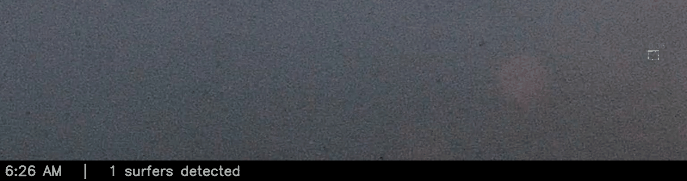

# Sum Surfers - An Automated Surfer Crowd Size Forecasting Tool

## Project Summary

This project collects images from a shoreline video camera and tries to answer two questions:
- **_How many surfers were out are out there each hour of each day in the past?_**
- **_How many will there be at each hour of the day in the upcoming days?_**

**_This matters to me as a surfer because the competition for each wave becomes more intense as the crowd size increases.  It helps me choose when to go and know what to expect. _**

<!-- DAILY_CHART_START -->
#### A Full Day of Surfer Detections: Monday, September 21, 2026

Each green box below contains a surfer, according to the object detection model.  Each number above a box indicates the probability that the object is a surfer.  Look carefully and you may find additional surfers that the model missed or other objects which are misclassified as surfers - like the wind sock at the bottom center of the photo.  Birds, reflections, people on the beach and sun glare fool it too: [what isn't a surfer](docs/non_surfer_objects.md) catalogs each one, how to tell it apart, and what the pipeline does about it.  Each frame is one hour of that day, one second apart, and the ends of the camera's view are cropped off so the surfers are big enough to see.


#### The Surfer Crowd Forecast for: Wednesday, September 23, 2026

Once enough hours and days were gathered along with weather and surf conditions, a surf count prediction model was built to forecast how many surfers would be present at each hour for the coming day.  This is useful for surfers to plan to avoid busy times or at least know what to expect.  The forecast still runs about one surfer low on average, and it misses by about five surfers in a typical hour - crowds depend on plenty of things the weather and surf data never see.  The detector underneath it used to undercount badly in fog and glare, which made the forecast worse; that was fixed in September 2026 by labeling those conditions and retraining, so what remains is the prediction model's own error.


<!-- DAILY_CHART_END -->

## How It Works, Step by Step

Each step below starts with the plain-language version, then the technical
detail and a link to the in-depth write-up.

1. **Gather video clips.**
   ***Every hour of daylight, the project downloads a short video clip from a camera pointed at the surf spot.***
   Clip collection runs from first light to last light for that date — the
   same first/last light times the surf forecast provider shows, about 30
   minutes before sunrise and after sunset — rather than fixed clock times, so
   it follows the seasons instead of wasting requests on darkness. Clips land in a dated folder and are deleted once
   frames have been pulled from them.
   → [The pipeline, end to end](docs/HOW_IT_WORKS.md#the-pipeline-end-to-end)

2. **Pull out still frames.**
   ***From each clip it saves three snapshots taken a few seconds apart, cropped down to just the patch of water where surfers sit.***
   The three frames sit at 1.0s, 2.5s and 4.0s into the clip, and each is
   cropped to the same fixed [region of interest](docs/HOW_IT_WORKS.md#term-roi)
   — a 1280×180 strip. Three frames rather than one because counts on the same
   stretch of water swing by several surfers within seconds as waves pass and
   people duck under; averaging cuts that noise.
   → [Multi-frame count averaging](docs/HOW_IT_WORKS.md#multi-frame-count-averaging)

3. **Screen out unusable pictures.**
   ***Frames too dark or too blurry to count are thrown away rather than guessed at.***
   Each primary frame is checked for brightness and for
   [Laplacian variance](docs/HOW_IT_WORKS.md#term-laplacian-variance), a
   standard measure of how much fine detail an image holds. Fog, fading evening light and
   a wet lens all fail it. Rejected frames are still logged with their scores,
   just never counted — a wrong number is worse than a missing one.
   → [Image-quality gate](docs/HOW_IT_WORKS.md#image-quality-gate)

4. **Find the surfers.**
   ***A model trained on thousands of hand-labeled examples draws a box around every surfer it can find.***
   Each frame is split into four overlapping horizontal tiles and
   [YOLOv8](docs/HOW_IT_WORKS.md#term-yolo) runs on each one. Tiling matters
   because a surfer is a handful of pixels in a 1280-pixel-wide strip; within a
   tile, the same surfer is proportionally much larger. This is the same family
   of technology behind pedestrian detection in self-driving cars.
   → [The model: YOLOv8](docs/HOW_IT_WORKS.md#the-model-yolov8)

5. **Merge the overlaps.**
   ***A surfer sitting on the seam between two tiles would be counted twice, so overlapping boxes are merged back into one.***
   Detections below a confidence threshold of 0.195 are dropped, then
   [non-maximum suppression](docs/HOW_IT_WORKS.md#term-nms) merges boxes that
   overlap across tile boundaries. Two zones that reliably produce false
   positives — a tree branch and a wind sock — are filtered by position.
   → [Confidence threshold and NMS, concretely](docs/HOW_IT_WORKS.md#confidence-threshold-and-nms-concretely)

6. **Keep score over time.**
   ***Each clip's three counts become one number, saved with its date and time.***
   The mean of the three frames is stored as that hour's count, along with all
   three raw values and their spread, so later analysis can tell a genuinely
   busy hour from a noisy one. This growing history is what the forecast model
   learns from — currently over 1,500 counted hours.
   → [The pipeline, end to end](docs/HOW_IT_WORKS.md#the-pipeline-end-to-end)

7. **Record the conditions.**
   ***Tide, swell, wind, weather and wave energy for that hour are stored next to every count.***
   Predictors come from the surf forecast provider's hourly endpoints, plus
   observed weather from Open-Meteo's archive and tide heights from NOAA, each
   matched to the nearest local hour of an existing count. Nearshore wave
   energy turns out to be the second most useful predictor after tide.
   → [Predictors: weather, tide, swell, wind, energy, consistency](docs/HOW_IT_WORKS.md#predictors-weather-tide-swell-wind-energy-consistency)

8. **Forecast the crowd.**
   ***A second model learns which conditions bring people out, then predicts tomorrow hour by hour with a likely range around each number.***
   Gradient-boosted trees fit the counts against those conditions: one model
   for the expected count, two more for the edges of an 80%
   [prediction interval](docs/HOW_IT_WORKS.md#term-prediction-interval). It is
   a forecast, not a guarantee — see [Model Calibration](#model-calibration)
   for how often that range actually holds, measured rather than claimed.
   → [Known limitations](docs/HOW_IT_WORKS.md#known-limitations-short-version)

9. **Publish it automatically.**
   ***Every night the animation and chart above are rebuilt and posted here on their own.***
   A scheduled job runs the whole pipeline after last light, rebuilds both images
   from the day's fresh data, and commits them to this repository. Nobody runs
   anything by hand, which is why the two images above are never more than a
   day old.
   → [The pipeline, end to end](docs/HOW_IT_WORKS.md#the-pipeline-end-to-end)

### How to Read the Daily Chart

- **Aqua line** — the model's single best-guess ("median") count for each
  hour.
- **Shaded band + side table** — the model's
  [prediction interval](docs/HOW_IT_WORKS.md#term-prediction-interval): the
  range the real count is expected to fall in on most days, shown as a single
  shaded 80% band around the line and repeated as plain numbers in the table,
  where the "Predicted" column is that hour's single best guess and "Range" is
  the band. **It isn't perfectly calibrated** — see
  [Model Calibration](#model-calibration) below for the real, measured accuracy
  of this range, not just the claimed one.
- **Weather markers** (circle/square/triangle/diamond) — the model's
  predicted weather condition for that hour, plotted at the median
  count.
- **Green dashed line (right-hand axis)** — predicted tide height, in
  feet.
- **Hatched band / "no training data" label** — flags hours with little
  or no real training data behind them (night hours, or hours outside
  the model's normal range) — treat those points as a rough
  extrapolation, not a confident prediction.
- **Caption** — the conditions driving that day's forecast, plus the
  detector's actual [precision](docs/HOW_IT_WORKS.md#term-precision) and
  [recall](docs/HOW_IT_WORKS.md#term-recall), measured on held-out images
  for the checkpoint actually deployed (not estimated).

See [HOW_IT_WORKS.md](docs/HOW_IT_WORKS.md) for a deeper walkthrough of
the detection pipeline and a glossary of every term used on this page,
and [PROJECT_HISTORY.md](docs/PROJECT_HISTORY.md) for the full history
of how the forecast model was built, tested, and tuned.

## Object Detection: Model, Training Data & Tools

The step that actually counts surfers in a picture — step 4 above — is an
**object detection** model. Object detection is a
computer-vision task: given an image, find every instance of a chosen
object type and draw a box around each one, rather than just labeling
the image as a whole ("this photo contains a surfer" vs. exactly where
and how many). It's the same underlying technology behind a photo app
circling faces or a self-driving car outlining nearby pedestrians — here
it's just pointed at a stretch of ocean, looking for surfers instead.

A model like this doesn't know what a surfer looks like on its own. It
has to be *trained*: shown a large number of real images where a human
has already drawn the correct box around every surfer, and left to
gradually adjust itself until its own boxes start matching those
examples closely. More and more varied examples generally make it
better at telling a real surfer apart from a bird, a shadow, or a patch
of whitewater.

### The Model: YOLO

This project uses **YOLO** ("You Only Look Once"), a well-known family
of object-detection models — specifically **YOLOv8s**, the "small," CPU-
friendly variant of version 8, via the open-source
[Ultralytics library](docs/HOW_IT_WORKS.md#main-resources). "Single-pass"
here means the model looks at the whole image once and predicts every
box, and how confident it is in each one, in one step — rather than
scanning it multiple times — which is what makes it fast enough to run
on an ordinary laptop with no dedicated graphics card. Because surfers
are small relative to the wide strip of ocean the camera sees, each
frame is first split into 4 overlapping tiles and the model runs on each
tile separately (see "Technical Overview" above) — a small object is
easier to find in a smaller, more zoomed-in image.

### Training Data & Labeling: CVAT

Training a model requires real, hand-labeled examples. This project's
57 training images (1,451 hand-drawn boxes total) were labeled using
[CVAT](docs/HOW_IT_WORKS.md#main-resources) (Computer Vision Annotation
Tool), an open-source browser tool made for exactly this kind of work —
a person opens each image, draws a box around every surfer in it, and
CVAT exports the result in a format the model can train on. Those 57
images were split 32/15/10 into training, validation, and test sets (a
model is trained only on the training set, and checked against images
it's never seen — validation and test — so its reported accuracy
reflects genuine performance, not memorization), and were tiled the same
4-way split described above before training, so the model learns on
exactly the shape of image it sees in production. See
[HOW_IT_WORKS.md](docs/HOW_IT_WORKS.md) for the full training walkthrough
and [`train_model.py`](code/train_model.py) for the retraining script
itself.

### Detector Training Metrics

Real per-[epoch](docs/HOW_IT_WORKS.md#term-epoch) training log for the
production YOLOv8s surfer detector — the September 2026 retrain, which added
labeled fog, glare and pose data (60 epochs) — 10 charts tracking how
training went, not estimated after the fact. The white dotted line on
each chart is a 5-epoch rolling average, to make the trend easier to
see through the epoch-to-epoch noise.

- **Top row, first 3 charts (aqua): training [loss](docs/HOW_IT_WORKS.md#term-loss)** —
  box loss, class loss, and DFL loss, measured on the data the model was
  actually training on. All three should generally trend downward, and
  do here — the model is getting better at matching its own training
  examples.
- **Bottom row, first 3 charts (aqua): validation loss** — the same
  three loss measurements, but on the held-out validation images the
  model never trains on. This is the more meaningful set of loss
  charts, since it shows how the model does on images it hasn't
  memorized. Box and class loss trend downward with more visible noise (validation
  is a much smaller set than training). **DFL loss creeps back up after
  about epoch 40** while the training DFL loss keeps falling — a mild
  sign of overfitting, and the reason the deployed checkpoint is taken
  from epoch 46 rather than the end of training.
- **Top row, last 2 charts (lime): [precision](docs/HOW_IT_WORKS.md#term-precision)
  and [recall](docs/HOW_IT_WORKS.md#term-recall)** — both computed on
  the validation set each epoch, not the training data, so they reflect
  genuine model performance rather than how well it memorized what it
  trained on. Both climb from noisy, mediocre starting values to about 88% and
  81%, with a rough patch in the first ~15 epochs
  where the model still hasn't learned much and both metrics swing
  widely epoch to epoch.
- **Bottom row, last 2 charts (lime): [mAP](docs/HOW_IT_WORKS.md#term-map)@0.5
  and mAP@0.5:0.95** — single-number summaries that combine precision
  and recall at one confidence threshold (0.5) or averaged across many
  stricter ones (0.5:0.95), also on the validation set. Same overall
  shape as precision/recall: noisy early on, climbing and flattening out
  by around epoch 40, which is a sign training had mostly converged by
  then rather than still improving at epoch 60.


The charts run to epoch 60, but the checkpoint actually deployed is
`best.pt` — **epoch 46** (dashed line), the epoch with the best
mAP@0.5:0.95, which is what the training run saves as "best". On the
validation set it gets **precision 88.5%, recall 81.3%, mAP@0.5 86.8%,
mAP@0.5:0.95 38.5%**. These are the numbers cited in the daily chart's
caption. They are measured on a harder validation set than the previous
model's, which now includes hazy fog frames, so they don't compare directly
with its 85.6%/82.0%.

The comparison that matters is whole-frame surfer counts on frames neither
model trained on. On hazy frames the new model finds **98%** of the real
surfers, against **59%** for the previous one; across all held-out frames
the average error per frame fell from 5.16 surfers to 0.94. Against
independent hand counts, its average error per frame halved (2.61 → 1.28).
The one regression was on ordinary clear-day frames, where it counted about
3–7% high. Most of that turned out to be one surfer drawn twice — a small box
nested inside a larger one, which survives overlap-based de-duplication because
the two boxes share little area relative to the larger one. Suppressing nested
boxes brought clear-day counts to **102%** of the human count and cut the
average error there by 38%, with hand-counted frames landing at exactly 100%.

Note that mAP@0.5:0.95 (38.5%) is much lower than mAP@0.5 (86.8%): it's an
average over much stricter box-overlap requirements (up to near-perfect box
placement), not a sign the model is worse than the headline number
suggests.

## Surfer Count Prediction Model

A separate modeling pipeline on top of `data/predictions/predictions.csv` +
`data/predictor_vars/surfline_predictors.csv`, built in three phases (see
[`PROJECT_HISTORY.md`](docs/PROJECT_HISTORY.md) for the full story,
including bugs found and fixed along the way). Scripts below
live in `code/`:

- `backfill_openmeteo_weather.py` — adds real observed historical
  weather (Open-Meteo archive API, free/no-auth) to
  `data/predictor_vars/openmeteo_weather.csv`.
- `build_training_features.py` — joins predictions (target) with
  predictors (features) for `quality_ok=True` rows, adds derived
  time-of-day/day-of-week/month features. Writes `data/training_features.csv`.
- `fit_surfer_count_model.py` — fits and compares a Poisson
  [GLM](docs/HOW_IT_WORKS.md#term-glm), a negative-binomial GLM, and
  [gradient-boosted trees (GBT)](docs/HOW_IT_WORKS.md#term-gbt) — GBT is
  the best performer, off by ~6 surfers on average
  ([MAE](docs/HOW_IT_WORKS.md#term-mae)) — plus GBT-based prediction
  intervals (see [Model Calibration](#model-calibration) below).
- `predict_surf_count.py` — pulls live tomorrow's forecast and outputs
  a prediction with an 80% range:
    ```bash
    python code/predict_surf_count.py                          # tomorrow, default hours
    python code/predict_surf_count.py --date 2026-08-28 --hours 07:10,12:00
    ```
- `demo_predictions.py` — shows N random held-out predictions
  alongside the actual count and conditions, for eyeballing model behavior.
- `plot_daily_prediction.py` + `daily_chart.sh` — generates a daily
  prediction chart (median line + a continuous 10-90% prediction-interval
  gradient with a side-by-side 80%-range table, tide, weather, night
  shading) and a detection-review image (real boxes/labels on the day's
  ~8am crop with the predicted range overlaid), auto-committed to the top
  of this README. Run via its own daily cron entry, independent of the
  twice-weekly clip pipeline. See "How to Read the Daily Chart" below for
  what everything on it means.

Caveat: held-out MAE is ~6 surfers on a typical count of ~15 — treat
outputs as directional estimates, not precise counts.

See [HOW_IT_WORKS.md](docs/HOW_IT_WORKS.md) for how the real-world
condition data above (weather, tide, swell, wind, wave energy) is
collected, and [PROJECT_FILES.md](docs/PROJECT_FILES.md) for a map of
every script and data file in this repo, including the clip-download and
detection scripts not listed above.

### Model Calibration

Empirical coverage of the GBT quantile prediction intervals, checked
directly against a held-out test split (`analysis/surf_count_model_calibration/plot_calibration.py`)
rather than trusted from the nominal target:


Measured 2026-09-22, after the whole history was recounted with the
September 2026 detector and the night frames were resolved by hand:
18% vs 20%, 36% vs 40%, 52% vs 60%, and **75.5% vs 80%**. Every band is
somewhat overconfident — real counts fall outside them more often than the
nominal level says — which is the ordinary direction for this kind of model
and the direction worth stating plainly.

The 80% band now misses **11.9% low and 12.5% high** against a 10% target on
each side: roughly symmetric, so both edges carry information. That is a
change from how this number read earlier the same day, and the reason is
worth spelling out, because the earlier reading was flattering for the wrong
cause.

Before the night-frame review, the check read 82% coverage, but it missed low
only 4.6% of the time — the band's bottom edge sat under 1 surfer for 72% of
hours, so there was almost nothing left to undershoot, and the apparent
calibration came from a floor rather than from the model. The review resolved
46 frames recorded outside the light window: 28 were genuinely unusable and
had been entering the record as empty hours or phantom counts. Removing them
cut the share of empty hours enough to un-pin the lower bound, which now sits
under 1 surfer for 22% of hours instead of 72%. Coverage fell from 82% to
75.5% *because* the interval became informative — the same thing that happened
on 2026-09-08, when correcting the swell data moved the lower bound off zero
and dropped coverage from 82.8% to 72%.

The pattern is consistent enough to state as a rule for reading this chart: a
coverage number near its target is only good news once you have checked that
both edges can actually be missed. See
[`PROJECT_HISTORY.md`](docs/PROJECT_HISTORY.md) for the full investigation.

### Exploratory Findings

Tide and weekend/weekday are the two strongest predictors of surfer count
at this spot (see [`PROJECT_HISTORY.md`](docs/PROJECT_HISTORY.md) for the full
GBT permutation-importance breakdown). A closer look at the weekend effect:

#### Weekday vs. Weekend

1. The weekend-to-weekday ratio varies noticeably by month — from about
   1.16-1.18x in March, May, and July 2026 up to nearly 2x in November
   2025 (also elevated, ~1.5x, in October/December 2025 and August
   2026). Some months show a much more pronounced weekend effect than
   others. We'll have to see if the trend holds once we have data from
   every month — several calendar months are still completely
   unrepresented in the dataset so far.
2. Weekends are also more variable day-to-day than weekdays: standard
   deviation 6.7 vs 5.6 surfers.


#### Daily Mean Count Kernel Density Estimate (KDE)

1. Each curve is normalized to its own group (n=61 weekdays, n=31
   weekends) — the taller weekday peak isn't a sample-size artifact.
2. Weekday counts cluster closer to their mean (std 5.6 vs 6.7), giving
   it a taller, narrower peak.
3. Weekends span a wider range (min 3.8 to max 33.8 vs weekday's 1.5 to
   28.0).


## Schedule

`local_pipeline.sh` (clip collection + detection) and
`daily_chart.sh` (the daily prediction chart) each run automatically on
their own recurring schedule on the machine hosting the pipeline —
`local_pipeline.sh` a couple times a week, `daily_chart.sh` once a day.
Both are safe to run manually any time; see each script for details.

## Run It Yourself (No Account Needed)

Most of this repo's collection path depends on a paid camera account, which
makes it hard for anyone else to reproduce. Three things do not need one:
collecting live data, checking the detector, and checking the forecast model.

### Collect live data

`watch_live.py` needs no account, no token, and no environment variables.

While it is running, it records a few seconds off the camera's public live
stream once every few minutes during daylight, cuts three frames from that
clip the same way the scheduled pipeline does, crops each to the region the
detector was trained on, counts surfers with the [trained model weights
committed to this repo](data/model_out/20260921_fog/train/weights),
and appends the averaged count to its own file — `data/live_watch/live_predictions.csv`,
with the same columns as the main predictions file, kept separate so a demo
run can never mix into the real dataset.

```bash
python3 -m venv .venv
source .venv/bin/activate
pip install -r docs/requirements.txt

python code/watch_live.py --once   # grab one frame and count it
python code/watch_live.py          # keep collecting until you stop it
```

It needs [ffmpeg](https://ffmpeg.org/) on your path to read the stream
(`brew install ffmpeg` or `apt install ffmpeg`).

The limitation is the flip side of needing no account: a live stream has no
rewind, so this collects only while your computer is awake and the script is
running. It cannot fill in the past. Outside the daylight window it waits
rather than collecting frames the [image quality gate](docs/HOW_IT_WORKS.md#term-image-quality-gate)
would reject anyway.

### Try the detector on a demo set

`data/demo/` holds **20 labeled frames chosen to cover the conditions that
matter here**: fog, sun glare with and without surfers in it, winter,
empty water, crowds from 0 to 56 surfers, and light from early morning to
evening, across May to December. None of them was used to train the
detector, so this is a fair test rather than a replay of its training data.

```bash
python code/eval_detector.py --coco-dir data/demo --split test --skip-tile-metrics
```

It runs the real production inference path — tiling, cross-tile
[NMS](docs/HOW_IT_WORKS.md#term-nms), false-positive filtering — on each
frame and compares the surfer count with the number of hand-drawn boxes,
frame by frame and broken out by crowd size. On the demo set it finds
**491 surfers against 498 labeled**, an average error of 0.85 surfers per
frame. That count is the number the forecast actually uses; a detector can
look fine box-by-box while still undercounting crowded frames.

The weights in this repo are the production detector, retrained in September
2026 on labeled fog, glare and pose data. The evaluator will also run on the
older labeled splits in `data/cvat_out_coco/splits/`, but those predate the
retrain and the new model trained on some of their frames, so it skips those
frames automatically (they are listed in
`data/model_out/20260921_fog/train_filenames.txt`). Per-box precision and
recall from Ultralytics' own validator can't skip them, so treat those as
optimistic. The demo set is the clean check.

### Check the forecast model against held-out data

`data/model_release/` holds the fitted forecast model, the **319 rows it was
never trained on**, and the metadata to reproduce the split:

```bash
python code/eval_surf_count_model.py
```

This ships the fitted model rather than only a table of predictions on
purpose. A predictions-versus-actuals file is self-reported — you can
recompute the error from it, but not check that the model was not fit on
those same rows. With the model included you can run it yourself on rows it
never saw; the script re-predicts from the raw predictor values and verifies
it reproduces the shipped numbers before reporting anything. The 1,275
training rows stay unpublished.

It reports MAE, RMSE and bias (broken out by how crowded the day actually
was, which is where the model's weakness shows), and
[prediction-interval](docs/HOW_IT_WORKS.md#term-prediction-interval) coverage
with the two tail-miss rates kept separate.

## Local Setup

1. Create and activate a virtual environment.
2. Install dependencies.
3. Add secrets to `.env`.
4. Run the pipeline.

```bash
python3 -m venv .venv
source .venv/bin/activate
pip install --upgrade pip
pip install -r docs/requirements.txt
cp .env.example .env
bash code/local_pipeline.sh
```

## Required Environment Variables

Create `.env` from `.env.example` and set:

- `SURFLINE_CAMERA_ID`
- `SURFLINE_ACCESS_TOKEN`

Optional:

- `MODEL_PATH` (override default YOLO weights path)
- `SMTP_USER` / `SMTP_APP_PASSWORD` / `EMAIL_TO` (Gmail App Password, for storage-warning emails)
- `CLIPS_DIR_LIMIT_GB` (local clip storage warning threshold, default 2.0)
- `DETECT_MODE` / `DETECT_RECENT_DAYS` / `DETECT_START_DATE` (detection scope)
- `SURFLINE_HISTORICAL_TOKEN` (only for `backfill_historical_predictors.py`,
  never read by the scheduled pipeline — see that script's docstring)

## Data Locations

- Clips: `data/not_needed_in_repo/surf_clips`
- Crops: `data/j_shore_cam/surf_crops`
- Predictions: `data/predictions/predictions.csv` — one row per clip:
  `date, time_local, filename, surfer_count, confidence_avg, quality_ok,
  quality_reason, brightness, lap_var, human_count, frame_count_1,
  frame_count_2, frame_count_3, frame_count_mean, frame_count_stdev`.
  `surfer_count`/`confidence_avg` are left blank when `quality_ok` is
  `False` (detection was skipped). `human_count` is filled in manually
  over time. `frame_count_*` are the 3 raw per-frame counts and their
  mean/stdev that `surfer_count` is averaged from.
- Predictor variables (weather/rating/tide/swell/wind/energy/consistency
  for Jack's, plus observed Open-Meteo weather): `data/predictor_vars/`
- Human-review datasets (image batches + a `review_counts.csv` to fill
  in), one subfolder per dataset: `data/reviews/`
- Model weights default (the September 2026 retrain):
  `data/model_out/20260921_fog/train/weights/best.pt`. The October 2025
  model it replaced is at `data/model_out/20251013/train/runs/detect/train13/weights/best.pt`.

## Analysis

One-off analyses (not part of the scheduled pipeline) each get their own
folder under `analysis/`, holding whatever mix of CSVs, charts, and
plotting/analysis scripts that investigation produced — see
[`PROJECT_FILES.md`](docs/PROJECT_FILES.md) for what's in each one.

