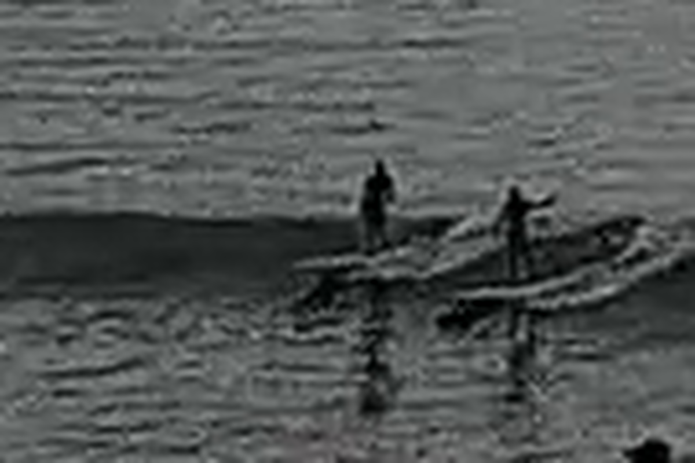
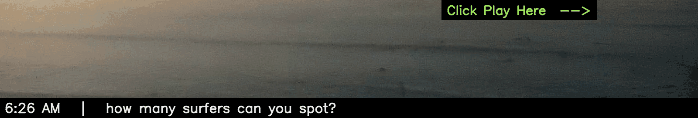
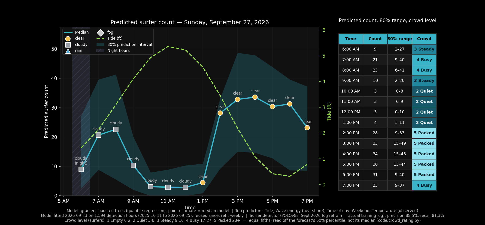
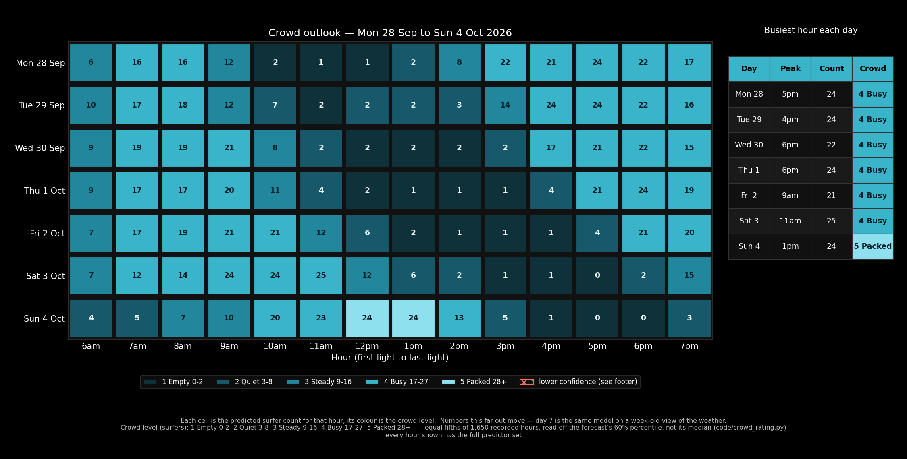
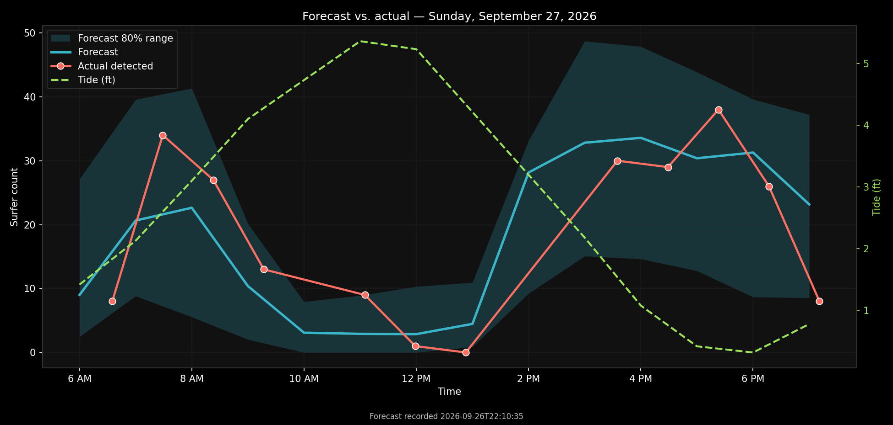
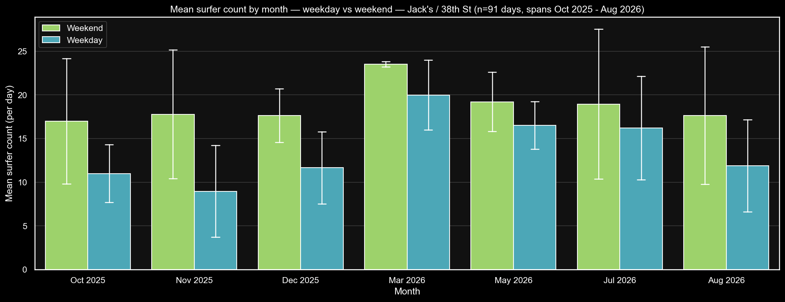
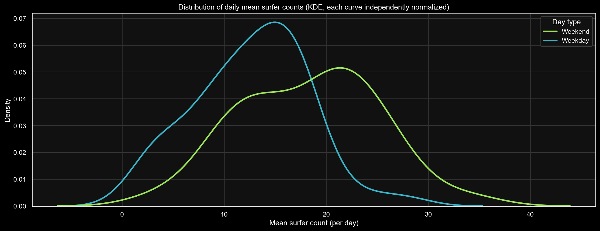

# Sum Surfers - An Automated Surfer Crowd Size Forecasting Tool

## Project Summary



This project collects images from a shoreline video camera and tries to answer two questions:
- **_How many surfers were out there each hour of each day in the past?_**
- **_How many will there be at each hour of the day in the upcoming days?_**

**_Why does this matter? As a surfer, I know that as as the crowd size grows, so does the competition for each wave.  It becomes difficult to not "drop in" on someone who is already on the wave or have to avoid surfers who drop in on you.  Forecasting surfer crowd size can help surfers know avoid peak crowding - or at least be ready for it._**

<!-- ====================================================================
     AUTO-GENERATED BLOCK - DO NOT EDIT BETWEEN THE MARKERS BELOW.
     Everything between the DAILY_CHART_START and DAILY_CHART_END markers is
     deleted and rewritten in full by code/plot_daily_prediction.py
     (update_readme) on every nightly run. Hand edits inside that region
     survive until 20:30 and are then silently lost.

     To change this wording, edit the caption templates in that file:
         DETECTION_CAPTION   the detection-GIF paragraph
         FORECAST_CAPTION    the daily-forecast-chart paragraph
         WEEK_CAPTION        the week-ahead-grid paragraph
     The headings and image links are assembled in update_readme() itself.
     ==================================================================== -->
<!-- DAILY_CHART_START -->
#### A Full Day of Surfer Detections: Friday, September 25, 2026

Each green box below contains a surfer, according to the object detection model.  Look carefully and you may find additional surfers that the model missed or other objects which are misclassified as surfers - like the wind sock at the bottom center of the photo.  Birds, reflections, people on the beach and sun glare fool it too: [what isn't a surfer](docs/non_surfer_objects.md) catalogs each one, how to tell it apart, and what the pipeline does about it.  **Each hour is shown twice: first the bare frame, so you can hunt for the surfers yourself as small dark specks, then the same frame with the model's boxes drawn.**  Try it before the boxes appear - it shows how hard these are to see, which is the whole problem the model is solving.  Each frame shows the camera's full width, the same strip the pipeline counts, so the number printed is the whole count for that hour.


#### The Surfer Crowd Forecast for: Saturday, September 26, 2026

Once enough hours and days were gathered along with weather and surf conditions, a surf count prediction model was built to forecast how many surfers would be present at each hour for the coming day.  This is useful for surfers to plan to avoid busy times or at least know what to expect.  The forecast still runs about one surfer low on average, and it misses by about five surfers in a typical hour - crowds depend on plenty of things the weather and surf data never see.  The detector underneath it used to undercount badly in fog and glare, which made the forecast worse; that was fixed in September 2026 by labeling those conditions and retraining, so what remains is the prediction model's own error.  The right-hand column rates each hour from 1 (near-empty) to 5 (packed), using the five equal slices of every hour the camera has counted so far.  [How to Read This Chart](#how-to-read-the-daily-chart)


#### The Week Ahead: September 26 - October 02, 2026

The same model, run out to a week. Every hour gets a crowd level from 1 (near-empty) to 5 (packed); the levels are the five equal slices of every hour the camera has counted so far, so level 3 is literally an average hour and level 5 is the busiest fifth of them. The number in each cell is the predicted count, and the colour is the level. The level is not read off that number: the forecast pulls toward the middle, so the middle of its range under-calls busy hours, and the level comes from a point higher up the range that was measured to catch them. Surf and weather data run the full seven days, but a forecast seven days out is still a forecast seven days out - read the far right of the grid as a shape, not a number.


<!-- DAILY_CHART_END -->
<!-- ====================================================================
     END AUTO-GENERATED BLOCK. Everything below here is hand-written and is
     never touched by the nightly run.
     ==================================================================== -->

## How Accurate Is This Forecast Right Now?

Surfer counts swing hard across a single day at this spot — from an empty
lineup to more than 70 in one hour — but average about **15 surfers per
daylight hour**. Against that, the forecast lands **within ±8 surfers about 80%
of the time**. Every forecast is written down before the day happens and scored
against what the detector later counted, so the record cannot be rewritten
after the fact.



*The most recently scored day, rebuilt and overwritten each night — the blue
line is what was forecast the evening before, the coral line is what the
detector counted, the shaded band is the 80% prediction range, and the dashed
green line is tide on the right-hand axis. This is the same chart that goes out
in the nightly email.*

Measured on 83 scored forecast-hours as of 2026-09-26, so treat it as an early
reading. For the fuller picture — per-hour error spread, accuracy by lead time,
and why the prediction bands are overconfident — see
[forecast accuracy and calibration](docs/HOW_IT_WORKS.md#forecast-accuracy-and-calibration) and
[`PROJECT_HISTORY.md`](docs/PROJECT_HISTORY.md). The raw scored record is
[`data/forecasts/forecast_log.csv`](data/forecasts/forecast_log.csv).


## How This Project Works

Each step below starts with the plain-language version, then the technical
detail and a link to the in-depth write-up.

1. **Gather video clips.**
   ***Every hour of daylight, the project downloads a short video clip from a camera pointed at the surf spot.***
   Clip collection runs from first light to last light for that date — the
   same first/last light times the surf forecast provider shows, about 30
   minutes before sunrise and after sunset — rather than fixed clock times, so
   it follows the seasons instead of wasting requests on darkness. Clips land in a dated folder and are deleted once
   frames have been pulled from them.
   → [The pipeline, end to end](docs/HOW_IT_WORKS.md#the-pipeline-end-to-end)

2. **Pull out still frames.**
   ***From each clip it saves three snapshots taken a few seconds apart, cropped down to just the patch of water where surfers sit.***
   The three frames sit at 1.0s, 2.5s and 4.0s into the clip, and each is
   cropped to the same fixed [region of interest](docs/HOW_IT_WORKS.md#term-roi)
   — a 1280×180 strip. Three frames rather than one because counts on the same
   stretch of water swing by several surfers within seconds as waves pass and
   people duck under; averaging cuts that noise.
   → [Multi-frame count averaging](docs/HOW_IT_WORKS.md#multi-frame-count-averaging)

3. **Screen out unusable pictures.**
   ***Frames too dark or too blurry to count are thrown away rather than guessed at.***
   Each primary frame is checked for brightness and for
   [Laplacian variance](docs/HOW_IT_WORKS.md#term-laplacian-variance), a
   standard measure of how much fine detail an image holds. Fog, fading evening light and
   a wet lens all fail it. Rejected frames are still logged with their scores,
   just never counted — a wrong number is worse than a missing one.
   → [Image-quality gate](docs/HOW_IT_WORKS.md#image-quality-gate)

4. **Find the surfers.**
   ***A model trained on thousands of hand-labeled examples draws a box around every surfer it can find.***
   Each frame is split into four overlapping horizontal tiles and
   [YOLOv8](docs/HOW_IT_WORKS.md#term-yolo) runs on each one. Tiling matters
   because a surfer is a handful of pixels in a 1280-pixel-wide strip; within a
   tile, the same surfer is proportionally much larger. This is the same family
   of technology behind pedestrian detection in self-driving cars.
   → [The model: YOLOv8](docs/HOW_IT_WORKS.md#the-model-yolov8)
   · [How it was trained](docs/HOW_IT_WORKS.md#the-training-data-cvat)
   · [How accurate the detector is](docs/HOW_IT_WORKS.md#detector-accuracy-the-deployed-checkpoint)

5. **Merge the overlaps.**
   ***A surfer sitting on the seam between two tiles would be counted twice, so overlapping boxes are merged back into one.***
   Detections below a confidence threshold of 0.195 are dropped, then
   [non-maximum suppression](docs/HOW_IT_WORKS.md#term-nms) merges boxes that
   overlap across tile boundaries. Two zones that reliably produce false
   positives — a tree branch and a wind sock — are filtered by position.
   → [Confidence threshold and NMS, concretely](docs/HOW_IT_WORKS.md#confidence-threshold-and-nms-concretely)

6. **Keep score over time.**
   ***Each clip's three counts become one number, saved with its date and time.***
   The mean of the three frames is stored as that hour's count, along with all
   three raw values and their spread, so later analysis can tell a genuinely
   busy hour from a noisy one. This growing history is what the forecast model
   learns from — currently over 1,500 counted hours.
   → [The pipeline, end to end](docs/HOW_IT_WORKS.md#the-pipeline-end-to-end)

7. **Record the conditions.**
   ***Tide, swell, wind, weather and wave energy for that hour are stored next to every count.***
   Predictors come from the surf forecast provider's hourly endpoints, plus
   observed weather from Open-Meteo's archive and tide heights from NOAA, each
   matched to the nearest local hour of an existing count. Nearshore wave
   energy turns out to be the second most useful predictor after tide.
   → [Predictors: weather, tide, swell, wind, energy, consistency](docs/HOW_IT_WORKS.md#predictors-weather-tide-swell-wind-energy-consistency)

8. **Forecast the crowd.**
   ***A second model learns which conditions bring people out, then predicts tomorrow hour by hour with a likely range around each number.***
   Gradient-boosted trees fit the counts against those conditions: one model
   for the expected count, two more for the edges of an 80%
   [prediction interval](docs/HOW_IT_WORKS.md#term-prediction-interval). It is
   a forecast, not a guarantee — see [forecast accuracy and calibration](docs/HOW_IT_WORKS.md#forecast-accuracy-and-calibration)
   for how often that range actually holds, measured rather than claimed.
   → [Known limitations](docs/HOW_IT_WORKS.md#known-limitations-short-version)

9. **Publish it automatically.**
   ***Every night the animation and chart above are rebuilt and posted here on their own.***
   A scheduled job runs the whole pipeline after last light, rebuilds both images
   from the day's fresh data, and commits them to this repository. Nobody runs
   anything by hand, which is why the two images above are never more than a
   day old.
   → [The pipeline, end to end](docs/HOW_IT_WORKS.md#the-pipeline-end-to-end)

## Exploratory Findings

Tide and weekend/weekday are the two strongest predictors of surfer count
at this spot (see [`PROJECT_HISTORY.md`](docs/PROJECT_HISTORY.md) for the full
GBT permutation-importance breakdown). A closer look at the weekend effect:

### Weekday vs. Weekend

1. The weekend-to-weekday ratio varies noticeably by month — from about
   1.16-1.18x in March, May, and July 2026 up to nearly 2x in November
   2025 (also elevated, ~1.5x, in October/December 2025 and August
   2026). Some months show a much more pronounced weekend effect than
   others. We'll have to see if the trend holds once we have data from
   every month — several calendar months are still completely
   unrepresented in the dataset so far.
2. Weekends are also more variable day-to-day than weekdays: standard
   deviation 6.7 vs 5.6 surfers.



### Daily Mean Count Kernel Density Estimate (KDE)

1. Each curve is normalized to its own group (n=61 weekdays, n=31
   weekends) — the taller weekday peak isn't a sample-size artifact.
2. Weekday counts cluster closer to their mean (std 5.6 vs 6.7), giving
   it a taller, narrower peak.
3. Weekends span a wider range (min 3.8 to max 33.8 vs weekday's 1.5 to
   28.0).



## Schedule

`local_pipeline.sh` (clip collection + detection) and
`daily_chart.sh` (the daily prediction chart) each run automatically on
their own recurring schedule on the machine hosting the pipeline —
`local_pipeline.sh` a couple times a week, `daily_chart.sh` once a day.
Both are safe to run manually any time; see each script for details.

## Run It Yourself (No Account Needed)

Most of this repo's collection path depends on a paid camera account, which
makes it hard for anyone else to reproduce. Three things do not need one:
collecting live data, checking the detector, and checking the forecast model.

### Collect live data

`watch_live.py` needs no account, no token, and no environment variables.

While it is running, it records a few seconds off the camera's public live
stream once every few minutes during daylight, cuts three frames from that
clip the same way the scheduled pipeline does, crops each to the region the
detector was trained on, counts surfers with the [trained model weights
committed to this repo](data/model_out/20260921_fog/train/weights),
and appends the averaged count to its own file — `data/live_watch/live_predictions.csv`,
with the same columns as the main predictions file, kept separate so a demo
run can never mix into the real dataset.

```bash
python3 -m venv .venv
source .venv/bin/activate
pip install -r docs/requirements.txt

python code/watch_live.py --once   # grab one frame and count it
python code/watch_live.py          # keep collecting until you stop it
```

Run it after dark and it will say so and ask whether to wait for first light,
rather than collecting frames it cannot count. Answer no and it exits; add
`--ignore-daylight` to grab a night frame anyway and watch the quality gate
reject it.

It needs [ffmpeg](https://ffmpeg.org/) on your path to read the stream
(`brew install ffmpeg` or `apt install ffmpeg`).

The limitation is the flip side of needing no account: a live stream has no
rewind, so this collects only while your computer is awake and the script is
running. It cannot fill in the past — which is why the scheduled pipeline uses
the account-only clip endpoint instead, and why roughly 40% of this project's
own counted hours come from days it recovered afterwards rather than watched
live.

### Try the detector on a demo set

`data/demo/` holds **20 labeled frames chosen to cover the conditions that
matter here**: fog, sun glare with and without surfers in it, winter,
empty water, crowds from 0 to 56 surfers, and light from early morning to
evening, across May to December. None of them was used to train the
detector, so this is a fair test rather than a replay of its training data.

```bash
python code/eval_detector.py --coco-dir data/demo --split test --skip-tile-metrics
```

It runs the real production inference path — tiling, cross-tile
[NMS](docs/HOW_IT_WORKS.md#term-nms), false-positive filtering — on each
frame and compares the surfer count with the number of hand-drawn boxes,
frame by frame and broken out by crowd size. On the demo set it finds
**491 surfers against 498 labeled**, an average error of 0.85 surfers per
frame. That count is the number the forecast actually uses; a detector can
look fine box-by-box while still undercounting crowded frames.

The weights in this repo are the production detector, retrained in September
2026 on labeled fog, glare and pose data. The evaluator will also run on the
older labeled splits in `data/cvat_out_coco/splits/`, but those predate the
retrain and the new model trained on some of their frames, so it skips those
frames automatically (they are listed in
`data/model_out/20260921_fog/train_filenames.txt`). Per-box precision and
recall from Ultralytics' own validator can't skip them, so treat those as
optimistic. The demo set is the clean check.

### Check the forecast model against held-out data

`data/model_release/` holds the fitted forecast model, the **352 rows it was
never trained on** (the most recent days, held out as a block), and the metadata to reproduce the split:

```bash
python code/eval_surf_count_model.py
```

This ships the fitted model rather than only a table of predictions on
purpose. A predictions-versus-actuals file is self-reported — you can
recompute the error from it, but not check that the model was not fit on
those same rows. With the model included you can run it yourself on rows it
never saw; the script re-predicts from the raw predictor values and verifies
it reproduces the shipped numbers before reporting anything. The 1,242
training rows stay unpublished.

It reports MAE, RMSE and bias (broken out by how crowded the day actually
was, which is where the model's weakness shows), and
[prediction-interval](docs/HOW_IT_WORKS.md#term-prediction-interval) coverage
with the two tail-miss rates kept separate.

## Local Setup

1. Create and activate a virtual environment.
2. Install dependencies.
3. Add secrets to `.env`.
4. Run the pipeline.

```bash
python3 -m venv .venv
source .venv/bin/activate
pip install --upgrade pip
pip install -r docs/requirements.txt
cp .env.example .env
bash code/local_pipeline.sh
```

## Required Environment Variables

Create `.env` from `.env.example` and set:

- `SURFLINE_CAMERA_ID`
- `SURFLINE_ACCESS_TOKEN`

Optional:

- `MODEL_PATH` (override default YOLO weights path)
- `SMTP_USER` / `SMTP_APP_PASSWORD` / `EMAIL_TO` (Gmail App Password, for storage-warning emails)
- `CLIPS_DIR_LIMIT_GB` (local clip storage warning threshold, default 2.0)
- `DETECT_MODE` / `DETECT_RECENT_DAYS` / `DETECT_START_DATE` (detection scope)
- `SURFLINE_HISTORICAL_TOKEN` (only for `backfill_historical_predictors.py`,
  never read by the scheduled pipeline — see that script's docstring)

## Data Locations

- Clips: `data/not_needed_in_repo/surf_clips`
- Crops: `data/j_shore_cam/surf_crops`
- Predictions: `data/predictions/predictions.csv` — one row per clip:
  `date, time_local, filename, surfer_count, confidence_avg, quality_ok,
  quality_reason, brightness, lap_var, human_count, frame_count_1,
  frame_count_2, frame_count_3, frame_count_mean, frame_count_stdev`.
  `surfer_count`/`confidence_avg` are left blank when `quality_ok` is
  `False` (detection was skipped). `human_count` is filled in manually
  over time. `frame_count_*` are the 3 raw per-frame counts and their
  mean/stdev that `surfer_count` is averaged from.
- Predictor variables (weather/rating/tide/swell/wind/energy/consistency
  for Jack's, plus observed Open-Meteo weather): `data/predictor_vars/`
- Human-review datasets (image batches + a `review_counts.csv` to fill
  in), one subfolder per dataset: `data/reviews/`
- Model weights default (the September 2026 retrain):
  `data/model_out/20260921_fog/train/weights/best.pt`. The October 2025
  model it replaced is at `data/model_out/20251013/train/runs/detect/train13/weights/best.pt`.

## Analysis

One-off analyses (not part of the scheduled pipeline) each get their own
folder under `analysis/`, holding whatever mix of CSVs, charts, and
plotting/analysis scripts that investigation produced — see
[`PROJECT_FILES.md`](docs/PROJECT_FILES.md) for what's in each one.

## How to Read the Daily Chart

- **Aqua line** — the model's single best-guess ("median") count for each
  hour.
- **Shaded band + side table** — the model's
  [prediction interval](docs/HOW_IT_WORKS.md#term-prediction-interval): the
  range the real count is expected to fall in on most days, shown as a single
  shaded 80% band around the line and repeated as plain numbers in the table,
  where the "Predicted" column is that hour's single best guess and "Range" is
  the band. **It isn't perfectly calibrated** — see
  [forecast accuracy and calibration](docs/HOW_IT_WORKS.md#forecast-accuracy-and-calibration) for the real, measured accuracy
  of this range, not just the claimed one.
- **Weather markers** (circle/square/triangle/diamond) — the model's
  predicted weather condition for that hour, plotted at the median
  count.
- **Green dashed line (right-hand axis)** — predicted tide height, in
  feet.
- **Hatched band / "no training data" label** — flags hours with little
  or no real training data behind them (night hours, or hours outside
  the model's normal range) — treat those points as a rough
  extrapolation, not a confident prediction.
- **Caption** — the conditions driving that day's forecast, plus the
  detector's actual [precision](docs/HOW_IT_WORKS.md#term-precision) and
  [recall](docs/HOW_IT_WORKS.md#term-recall), measured on held-out images
  for the checkpoint actually deployed (not estimated).

See [HOW_IT_WORKS.md](docs/HOW_IT_WORKS.md) for a deeper walkthrough of
the detection pipeline and a glossary of every term used on this page,
and [PROJECT_HISTORY.md](docs/PROJECT_HISTORY.md) for the full history
of how the forecast model was built, tested, and tuned.
