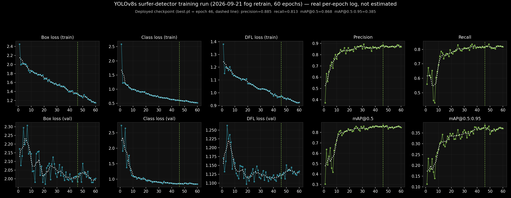
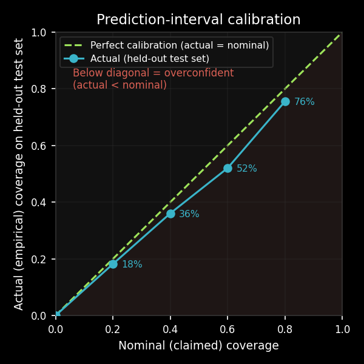

# How the Object Detection Model Works

A plain-language walkthrough of how a raw camera frame becomes a surfer
count, plus a glossary for the terminology used throughout this repo and
in `PROJECT_HISTORY.md`.

## The pipeline, end to end

1. **Capture**: `code/get_clips.py` downloads short video clips from the
   Surfline camera.
2. **Frame + crop**: `code/get_cropped_frame.py` grabs **three** frames per
   clip — a primary frame at 2.5s in, plus two "side" frames 1.5s before
   and after it — and crops each down to a fixed region of interest (ROI):
   a wide, short strip of the ocean, `1280×180` pixels. Three frames exist
   because counts on the *same* clip vary meaningfully second to second
   (occlusion by whitewater, a surfer paddling behind another) — see
   "Multi-frame count averaging" below.
3. **Image-quality gate**: before running the (expensive) model at all,
   the primary crop is checked for whether it's even usable — see
   "Image-quality gate" below. Frames that fail skip detection entirely
   (for all three frames); `surfer_count` is left blank for them in
   `data/predictions/predictions.csv` rather than guessed.
4. **Tiling**: that strip is an unusual shape for an object-detection model
   (very wide, very short), and surfers are small relative to the whole
   frame. Rather than feed the model the whole strip at once, each of the
   three frames is split into **4 overlapping horizontal tiles** (376×180px
   each, 20% overlap), matching how the training data was tiled. Smaller,
   more "normal-shaped" tiles make small, distant surfers easier for the
   model to find.
5. **Detection**: each tile is run through the trained **YOLOv8** model
   separately, producing a list of candidate boxes, each with a
   **confidence score**.
6. **Merge + de-duplicate**: because tiles overlap, a surfer near a tile
   boundary can get detected twice (once in each tile). All the boxes from
   all 4 tiles are translated back into the full-frame's coordinate system,
   then **Non-Maximum Suppression (NMS)** removes the duplicates. NMS alone
   misses one common case: a small box sitting entirely *inside* a larger
   one. Their IoU is low — the union is nearly the whole large box — so both
   survive, and one surfer gets counted twice. A second pass therefore drops
   the lower-confidence box of any pair whose overlap exceeds 70% of the
   *smaller* box's area. This cut clear-day counts from 107% of the human
   count to 102%.
7. **False-positive filtering**: a couple of known static objects in the
   scene (a tree bough on the right edge, a flag/wind sock at the bottom)
   reliably trigger false detections. A small coordinate-based filter drops
   boxes that land in those specific zones — see `code/detect_surfers.py`
   and `PROJECT_HISTORY.md` for exactly how those zones were derived.
8. **Count + average**: steps 4-7 run independently on all three frames,
   giving three per-frame counts. The row's `surfer_count` is the mean of
   the three (rounded), and `confidence_avg` is the mean of their average
   confidences — appended to `data/predictions/predictions.csv` along with the raw
   per-frame counts, mean, and standard deviation (see below).

## Multi-frame count averaging

A single instant of video is a noisy sample of "how many surfers are out
there" — a surfer can be briefly hidden behind whitewater, mid-paddle
behind another surfer, or just outside a tile boundary in one specific
frame. Testing on real clips confirmed this: counts on the *same* ~6-second
clip varied by up to 7 surfers across frames just 1.5-3 seconds apart (see
`PROJECT_HISTORY.md`, 2026-08-25 entry, for the actual numbers).

To reduce that noise, `code/get_cropped_frame.py` extracts three frames per
clip instead of one (primary + two side frames), and `code/detect_surfers.py`
runs detection on all three (`run_inference_multi()`), averaging the
results. `predictions.csv` stores the full detail, not just the average:

- `frame_count_1` / `frame_count_2` / `frame_count_3` — the three raw
  per-frame counts, in chronological order (frame 2 is always the original
  2.5s primary frame, so this stays comparable to how counts were computed
  before this change).
- `frame_count_mean` / `frame_count_stdev` — the average (what
  `surfer_count` is rounded from) and how much the three frames disagreed.
  A high stdev is itself a signal: it flags a scene that's ambiguous or
  changing fast (overlapping surfers, choppy conditions), similar in spirit
  to how `lap_var` flags an unreliable *image* rather than an unreliable
  *count*.

**Historical backfill**: for existing `predictions.csv` rows where the raw
clip is still on disk, `code/backfill_multiframe_counts.py` fills in the
`frame_count_*` columns without touching the original `surfer_count`/
`confidence_avg` — those were already referenced by prior manual review
work, so they're left as-is; the new columns are purely additive. Rows
whose clip has since been deleted (per the clip-storage cleanup policy)
simply never get `frame_count_*` populated — `run_inference_multi()` falls
back to single-frame behavior automatically when side frames aren't
available, so nothing breaks, it just can't be improved retroactively.

## Image-quality gate

Fog, lens condensation, low light, and night frames all degrade detection
in ways that don't just lower confidence — the model often doesn't
generate any candidate boxes there at all, so there's nothing to recover
by tuning thresholds after the fact (see `PROJECT_HISTORY.md`'s
confidence-threshold experiment). Rather than count those frames
unreliably, `code/detect_surfers.py`'s `compute_image_quality()` checks
two cheap image statistics before detection ever runs:

- **Brightness** (mean grayscale pixel value) — too low means the frame is
  effectively night, even accounting for ambient light like streetlight
  reflections in fog.
- **Laplacian variance** (`lap_var`, a standard blur/detail proxy — see
  glossary) — too low means the frame is too foggy, blurred, or lens-
  condensation-affected to trust, independent of brightness.
A third statistic, **glare fraction**, is recorded per frame but does *not*
gate anything. It is the share of pixels brighter than `QUALITY_GLARE_LEVEL`
(240), written to the `glare_frac` column by `compute_glare_frac()`.
Low-angle autumn and winter sun lays a path of specular glitter across the
water and the detector reads the sparkle as heads — on labeled frames it
reported 49, 30, 18, 17, 16 and 15 surfers on water holding 0, 0, 0, 5, 0
and 3 — and the two checks above pass those frames comfortably, since
glittery water is both bright and sharp.

It is recorded rather than gated because the measure cannot separate glare
from sunlit whitewater at the low end: one frame at 0.0020 is ordinary foam
with about 30 plainly countable surfers, while 0.0032 is a glare path with
none. Neither small-blob share nor local-context brightness told them apart.
Gating on it would discard good crowded frames to catch bad ones, so the
column exists to make contaminated rows findable, and the real fix is the 21
labeled empty glare frames now in the training pool.

A frame fails the gate if brightness is below `QUALITY_BRIGHTNESS_THRESH`
**or** `lap_var` is below `QUALITY_LAPVAR_THRESH` (both in
`code/detect_surfers.py`). Two separate branches are used instead of one
combined score because night and fog push brightness in *opposite*
directions — night is dark, fog is artificially bright — so a single
brightness term can't represent both failure modes correctly at once.
Thresholds were fit on 169 hand-labeled images across four review
batches; see `PROJECT_HISTORY.md` for the full derivation, accuracy
numbers, and known limitations (this is a first-pass estimate, not a
solved problem).

A third rule (added 2026-09-22) catches a failure the first two let
through. Frames recorded **before first light or after last light** can be
both bright enough and sharp enough to pass, because the camera raises gain
in the dark and the amplified noise looks like detail. The tell is
counter-intuitive: *high* `lap_var`, since sensor noise is higher-frequency
than real water. So an out-of-window frame with `lap_var` above 180 is
rejected as `night_sensor_noise`.

The scope matters as much as the threshold. This rule was fit on 46
out-of-window frames counted by hand (28 unusable, 18 countable), where it
sorts 38 of the 46 correctly. Applied to *every* frame it would be actively
harmful — `brightness < 90 and lap_var > 180` rejects 29% of all frames that
currently pass, mostly bright mid-afternoon ones, including 272 frames
holding five or more surfers. Overcast daylight is dim and real water texture
is sharp, so the two conditions fire together constantly on good frames.
A clock-only rule fails too: one reviewed frame 14 minutes *before* first
light is perfectly countable, while frames 0-4 minutes out are not. Usable
light does not track the almanac, which is why the image statistic does the
work and the clock only decides where to apply it.

Failed frames are still recorded in `predictions.csv` — with
`quality_ok=False`, a `quality_reason`, and the measured `brightness`/
`lap_var` — so the data is kept for tuning, but `surfer_count` is left
blank rather than treated as zero or estimated.

## The model: YOLOv8

**YOLO** ("You Only Look Once") is a family of *single-pass* object
detectors — unlike older approaches that scan an image in multiple stages,
YOLO looks at the whole image once and directly predicts all the bounding
boxes, their classes, and their confidence scores in one forward pass.
That makes it fast enough to run on a laptop CPU, which matters here since
this pipeline has no GPU.

This project uses **YOLOv8s** (the "small" size variant) via the
[Ultralytics](https://docs.ultralytics.com/) library, trained on a single
class: `surfer`.

## The training data: CVAT

The training images (raw camera crops from the early manual test captures,
now archived — see `PROJECT_FILES.md`) were hand-annotated using
[CVAT](https://www.cvat.ai/) (Computer Vision Annotation Tool) — an
open-source browser tool for drawing bounding boxes on images. Each
surfer in each training image got a box drawn around it; CVAT then
exports that as a dataset the model can train on, in either **COCO** or
**YOLO** annotation format (see glossary below) — both formats were
exported and are kept in `data/cvat_out_coco/` and
`data/cvat_out_yolo_rebuilt/`.

The exported images were tiled to match the same 4-tile split described
above, so the model trains on exactly the shape of input it'll see in
production.

## Confidence threshold and NMS, concretely

Two numbers in `code/detect_surfers.py` control what actually gets
counted:

- **`CONF_THRESH` (0.195)**: the model assigns every candidate box a
  confidence score from 0-1. Anything below this cutoff is discarded
  before it's even considered a detection. Lower this number and the
  model reports more boxes (recovers weaker, less-certain detections, but
  risks more false positives).

  This was re-swept in September 2026 after the detector was retrained, on
  76 held-out frames holding 1,419 labeled surfers, and 0.195 survived: the
  whole-frame count error bottoms out at 0.200, essentially where it already
  sat, and the F1 score is nearly flat anywhere between 0.125 and 0.425.
  A tempting refinement — a *lower* threshold near the bottom of the frame,
  where whitewater makes surfers hardest to see — turned out not to pay:
  recall there rises only 78% to 80% and the change in count error sits
  inside the noise. The bottom line is that this number is no longer where the
  remaining accuracy is.
- **`IOU_NMS` (0.45)**: when two boxes overlap by more than this fraction
  (their **IoU** — see glossary), NMS treats them as duplicates of the
  same object and keeps only the higher-confidence one.
- **`CONTAINMENT_THRESH` (0.7)**: the nested-box rule from step 6 above —
  if two boxes overlap by more than 70% of the *smaller* box's area, the
  lower-confidence one is dropped. This catches the duplicates that IoU
  cannot see.

The daily detection animation (`data/charts/latest_detection.gif`,
generated by `code/plot_daily_prediction.py` and embedded at the top of
the README) draws this same `CONF_THRESH` cutoff directly on the image: a
box only appears if the model's confidence for it was 0.195 or higher, and
each box's label is that confidence score. The image's own caption repeats
the threshold so it's readable without cross-referencing this doc.

## Detector accuracy: the deployed checkpoint

The production detector is the September 2026 retrain, which added labeled fog,
glare and pose data and ran 60 epochs. The checkpoint actually deployed is
`best.pt` — **epoch 46**, the epoch with the best mAP@0.5:0.95, which is what
the training run saves as "best" — not the last epoch. Validation DFL loss
creeps back up after about epoch 40 while training DFL loss keeps falling, a
mild sign of overfitting, and that is why the run does not simply keep the end
of training.

On the validation set that checkpoint scores **precision 88.5%, recall 81.3%,
[mAP](#term-map)@0.5 86.8%, mAP@0.5:0.95 38.5%**. These are the numbers quoted
in the daily chart's caption. They sit on a harder validation set than the
previous model's, which now includes hazy fog frames, so they do not compare
directly with its 85.6% / 82.0%.

mAP@0.5:0.95 (38.5%) being far below mAP@0.5 (86.8%) is expected rather than
alarming: it averages over much stricter box-overlap requirements, up to
near-perfect box placement, which is not what this project needs — a box that
lands on the right surfer counts that surfer correctly whether or not it hugs
the outline.

The per-epoch training log above is real, not reconstructed after the fact. The
white dotted line on each chart is a 5-epoch rolling average. The top and bottom
rows' first three charts are training and validation [loss](#term-loss) (box,
class, DFL); the validation row is the meaningful one, since it is measured on
images the model never trains on. The last two charts in each row are
[precision](#term-precision) / [recall](#term-recall) and mAP, all computed on
validation data each epoch. Precision and recall climb from noisy starting
values to roughly 88% and 81%, flattening by about epoch 40 — training had
largely converged well before epoch 60.

**What the retrain was worth, measured on whole-frame counts rather than
validation boxes**, on frames neither model trained on: on hazy frames the new
model finds **98%** of the real surfers against **59%** for the old one, and
across all held-out frames the average error per frame fell from 5.16 surfers to
0.94. Against independent hand counts its average error per frame halved, 2.61 →
1.28. The one regression was ordinary clear-day frames, counted about 3–7% high;
most of that was one surfer boxed twice, a small box nested inside a larger one,
which survives overlap-based de-duplication because the two boxes share little
area relative to the larger one. Suppressing nested boxes brought clear-day
counts to **102%** of the human count and cut average error there by 38%, with
hand-counted frames landing at exactly 100%.

## Predictors: weather, tide, swell, wind, energy, consistency

Separate from detection, `code/get_surf_predictors.py` pulls conditions
data for Jack's from Surfline's public forecast API
(`services.surfline.com/kbyg/spots/forecasts/*`) and writes it to
`data/predictor_vars/surfline_predictors.csv`, matched to `predictions.csv` rows by
filename/nearest hour. This is forward-looking only (today + tomorrow) —
it runs on every scheduled pipeline execution and just accumulates
whatever "today" happens to be each time.

For **historical** dates, the same endpoints accept a `start=YYYY-MM-DD`
parameter, but require an authenticated, premium Surfline session (an
`x-auth-accesstoken` header) — anonymous requests are capped at
yesterday. `code/backfill_historical_predictors.py` is a separate,
manually-run script (not part of the scheduled pipeline) that uses this
to backfill predictors for existing `predictions.csv` rows. See that
script's docstring for usage, and `PROJECT_HISTORY.md` for how the
mechanism was discovered.

## Forecast accuracy and calibration

The forecast model is off by about **7.6 surfers** ([MAE](#term-mae)) on a
typical count of around 16 when asked to predict days it has never seen. Treat
its outputs as directional estimates, not precise counts.

**That number went up on 2026-09-23, and the model did not get worse.** Until
then accuracy was measured with a random 80/20 split of *hours*. At roughly 13
hours per day that puts hours from the same day on both sides of the split: the
model learned a day's crowd level from that day's own hours and was then scored
on the rest of it, which is not a forecast but a fill-in. Splitting by whole day
costs about 1.2 MAE, and holding out the most recent days rather than random ones
costs about another 0.8, because the model then also has to cope with a genuine
seasonal level shift. The published figure is now the forward-in-time one: fit on
the past, scored on days that had not happened yet, which is the only version
that matches how the forecast is used.

Empirical coverage of the GBT quantile [prediction intervals](#term-prediction-interval)
is checked directly against a held-out split by
`analysis/surf_count_model_calibration/plot_calibration.py`, rather than trusted
from the nominal target:

Measured 2026-09-23, holding out the most recent days as a block: **15% vs 20%,
26% vs 40%, 36% vs 60%, and 71.9% vs 80%**. Every band is overconfident — real
counts fall outside them more often than the nominal level says — and the narrow
bands badly so. The 80% band misses **9.4% low and 18.8% high** against a 10%
target on each side. The low edge is about right; the high edge is where the
model loses, which is the same mean-reversion that makes it under-call crowded
hours.

**A rule for reading any coverage number here**, learned twice the hard way:
a coverage figure near its target is only good news once you have checked that
both edges can actually be missed. Before the night-frame review this check read
82% coverage while missing low only 4.6% of the time — the band's bottom edge sat
under 1 surfer for 72% of hours, so there was almost nothing left to undershoot,
and the apparent calibration came from a floor rather than from the model.
Resolving 46 frames recorded outside the light window (28 genuinely unusable, and
entering the record as empty hours or phantom counts) un-pinned that lower bound,
which now sits under 1 surfer for 22% of hours instead of 72%. Coverage fell from
82% to 75.5% *because* the interval became informative. The same thing happened on
2026-09-08, when correcting the swell data moved the lower bound off zero and
dropped coverage from 82.8% to 72%.

Full investigation in `PROJECT_HISTORY.md`.

## Known limitations (short version)

Fog, lens condensation, and low light all degrade the model's ability to
generate any candidate boxes at all — not just lower their confidence.
The image-quality gate above (implemented 2026-08-25) catches the clearest
cases of this; the boundary between "moderately foggy but still countable"
and "too foggy to trust" is inherently continuous, not a hard line, so
some frames will still be misclassified either direction. Retraining on
labeled fog and glare frames in September 2026 did more for this than any
filter: on held-out hazy frames the detector went from finding 59% of the
real surfers to 98%.

Things other than surfers still get boxed — birds (and, in one measured
case, a bird's *reflection*), people walking the beach, and one surfer
occasionally split into two side-by-side boxes.
[What isn't a surfer](non_surfer_objects.md) catalogs each one with its
visual tell and current handling.

Full investigation, metrics, and known error rates are in
`PROJECT_HISTORY.md`.

---

## Glossary

- **Bounding box** — a rectangle (x1, y1, x2, y2 coordinates) drawn around
  a detected object.
- **Confidence score** — the model's own estimate (0-1) of how sure it is
  that a given box actually contains the object class it's predicting.
- **CVAT** — Computer Vision Annotation Tool, the software used to
  hand-label surfers in the training images. [cvat.ai](https://www.cvat.ai/)
- **COCO format** — a common JSON-based annotation format for object
  detection datasets (named after the "Common Objects in Context" dataset
  that popularized it).
- **Epoch** — one full pass through the entire training dataset during
  training. This model trained for 60 epochs; the weights actually deployed
  are the best-scoring checkpoint along the way (epoch 46 for the current
  detector), not the last one, since later epochs can overfit.
- **GBT (Gradient-Boosted Trees)** — the model type used for the
  surfer-count forecast (a separate model from the YOLOv8 detector above,
  see `PROJECT_HISTORY.md`'s "Surfer Count Prediction Model" section).
  Builds many small decision trees one after another, each one correcting
  the errors of the trees before it.
- **GLM (Generalized Linear Model)** — a family of statistical models
  (e.g. Poisson, negative-binomial) tried as an alternative to GBT for
  the surfer-count forecast; GBT ended up more accurate, see
  `PROJECT_HISTORY.md`.
- **Ground truth** — the "correct answer" — in this project, the
  hand-drawn CVAT boxes (for the training/test data) or a human's manual
  count (for the later review batches), used to measure how well the
  model is actually doing.
- **Image-quality gate** — the pre-detection check (see above) that skips
  running the model on frames too dark or too low-detail to reliably
  count, based on brightness and `lap_var`, plus a narrower rule that
  rejects frames outside the first-light/last-light window whose high
  `lap_var` is amplified sensor noise rather than detail.
- **IoU (Intersection over Union)** — a measure of how much two boxes
  overlap: the area they share divided by the total area they cover
  together. 1.0 = identical boxes, 0.0 = no overlap at all. Used both to
  decide if two predicted boxes are "the same" detection (NMS) and to
  decide if a predicted box "matches" a ground-truth box when scoring
  accuracy.
- **Loss** — a single number a model tries to minimize during
  training: how wrong its current predictions are, measured against
  ground truth. Each epoch adjusts the model to make this number a
  little smaller. YOLOv8 tracks three separate loss components: **box
  loss** (how far off a predicted box's edges are from the real box),
  **class loss** (how confident/correct the predicted class label
  was — with only one class, "surfer," here, this mostly measures how
  well the model recognizes "surfer-ness" itself), and **DFL loss**
  (Distribution Focal Loss, a more fine-grained measure of exactly how
  precisely each box edge is placed). All three should trend downward
  over training if it's going well; each is tracked separately for the
  training data and the held-out validation data, so a training loss
  that keeps dropping while validation loss stalls or rises is a sign of
  overfitting.
- **Laplacian variance (`lap_var`)** — a standard no-reference blur/detail
  metric: apply a Laplacian (edge-detecting) filter to the image, then
  take the variance of the result. Sharp, detailed images have lots of
  strong edges and a high variance; blurry, foggy, or low-texture images
  have few strong edges and a low variance. Used here as a general
  "unreliable image" signal, since fog, lens condensation, and smooth
  low-texture water all suppress it similarly.
- **MAE (Mean Absolute Error)** — the average, across every prediction, of
  how far off (in either direction) that prediction was from the real
  value, ignoring sign — e.g. an MAE of 6 surfers means predictions are,
  on average, 6 surfers away from the actual count. Used to judge the
  surfer-count forecast model, not the detector (which uses mAP below).
- **mAP (mean Average Precision)** — a standard single-number summary of
  object-detection quality, combining precision and recall across
  different confidence thresholds. Shows up in this model's training
  logs (`results.csv`) but is a *box-level* metric — not directly
  comparable to the *count-level* MAE/bias numbers used elsewhere in this
  project's review work (see `PROJECT_HISTORY.md` for why).
- **NMS (Non-Maximum Suppression)** — the de-duplication step: among a
  group of overlapping boxes (above the IoU threshold), keep only the one
  with the highest confidence and discard the rest. Because IoU compares
  overlap against the *combined* area of both boxes, it does not catch a
  small box nested inside a large one; this pipeline adds a separate
  containment check for that case (see step 6).
- **Prediction interval** (vs. **confidence interval**) — both describe a
  range of uncertainty, but around different things. A confidence
  interval is about an *average* (e.g. "the average count at 2pm is
  probably between X and Y"); a prediction interval is about *one
  individual future observation* (e.g. "today's count at 2pm will
  probably be between X and Y"). The surfer-count forecast's shaded band
  in the README is a prediction interval — the right concept for a
  one-day forecast, not a long-run average. Built here from **quantile
  regression**: instead of one GBT model predicting the average count, a
  separate GBT is fit for each percentile (e.g. the 10th and 90th), and
  the gap between them forms the interval.
- **Precision** — of everything the model *flagged* as a surfer, what
  fraction actually were surfers. Low precision = lots of false positives.
- **Recall** — of everything that *actually was* a surfer, what fraction
  did the model find. Low recall = lots of missed surfers (undercounting).
- **ROI (Region of Interest)** — the fixed rectangular crop of the raw
  camera frame that the pipeline actually processes (the ocean strip,
  excluding sky/shore clutter above and below it).
- **Tile / tiling** — splitting one image into smaller overlapping pieces
  before running the model, then merging the results back together. Used
  here because the ROI's wide, short shape and the surfers' small size
  within it make full-frame detection less reliable than tiled detection.
- **YOLO (You Only Look Once)** — the object-detection model family used
  in this project. [Ultralytics YOLOv8 docs](https://docs.ultralytics.com/)
- **YOLO format (annotation)** — a plain-text annotation format (one
  `.txt` file per image, one line per box: class + normalized center
  x/y/width/height) — simpler than COCO's JSON, and what
  `code/detect_surfers.py`'s ground-truth comparisons were built from.

## Main resources

- [Ultralytics YOLOv8 documentation](https://docs.ultralytics.com/) — the
  library and model family used for detection.
- [CVAT](https://www.cvat.ai/) — the annotation tool used to build the
  training/test datasets.
